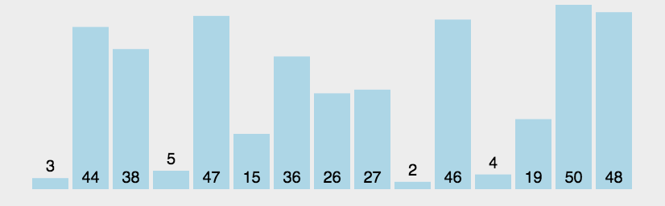

Bubble sort 冒泡排序
=======

#### 算法介绍
  1 我们按照从小到大的顺序排序</br>
  2 冒泡排序就是简单的每次交换排序</br>
  3 我们拿体育课排按身高进行排队</br>
    1号和2号比高，如果1号比2号高，那么1号和2号进行交换位置。</br>
  4 2号位置现在是前两个最高的，我们继续拿2号位置和3号位置比高。</br>
  5 上述步骤执行下去，我们每次都能选出第i次最高的那个人</br>
  6 我们在第i次的时候，已经完成了后面i个人的身高排序。我们每次只需要比 总人数-i-1次即可选出目前最高的人。</br>
  7 每次选出一个人，最后我们只需要进行总人数-1次循环就好。</br>
#### 动态图演示

```c
#include <stdio.h>
#include <stdio.h>

//定义bubble_sort函数
void swap_arr(int arr[], int i, int j) {
    int temp = arr[i];
    arr[i] = arr[j];
    arr[j] = temp;
    return;
}

void bubble_sort(int *arr, int len) {
    int i, j, flag, temp;
    for (i = 0; i < len - 1; i++) {
        flag = 0;
        for (j = 0; j < len - 1 - i; j++) {
            if (arr[j] > arr[j + 1]) {
                swap_arr(arr, j, j + 1);
                flag = 1;
            }
        }
        if (flag == 0) {
            break;
        }
    }
    return;
}

void print_arr(int arr[], int len) {
    for (int i = 0; i < len; i++) {
        printf("%4d", arr[i]);
    }
    printf("\n");
    return;
}

int main() {
    int arr[10] = {87, 54, 15, 96, 75, 1, 67, 23, 18, 88};
    int len = sizeof(arr) / sizeof(int);
    printf("before short:\n");
    print_arr(arr, len);
    bubble_sort(arr, len);
    printf("after sort:");
    print_arr(arr, len);

    return 0;
}
```
