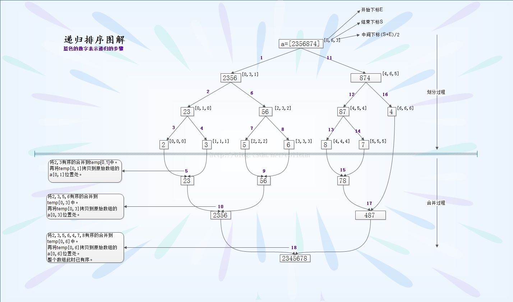

归并排序
-------
#### 算法介绍
  1 把长度为n的序列分成两个长度为```n/2```的序列
  2 将两个序列继续使用归并排序
  3 将两个排序好的序列合并成为一个最终的有序序列

  要解决的第一个问题，如何将两个序列合成一个有序序列
#### 动图演示



#### 数组的归并排序实现
```c
//归并排序
//递归将序列分成n/2的小序列，对每个序列进行排序
//合并两个序列。

#include <stdio.h>
#include <stdlib.h>

//定义函数打印算法
void print_arr(int arr[], int len) {
    for (int i = 0; i < len; i++) {
        printf("%4d", arr[i]);
    }
    printf("\n");
    return;
}

//并算法，,借助对空间，将arr[2]并到arr[1]上面
void merge_arr(int arr1[], int arr2[], int len1, int len2) {
    //申请新的堆空间
    int *arr = (int *) malloc(sizeof(int) * (len1 + len2));
    //归并排序
    int i = 0, j = 0, k = 0;
    while (k < (len1 + len2)) {
        if (i < len1 && j < len2) {
            arr[k++] = (arr1[i] > arr2[j] ? arr2[j++] : arr1[i++]);
        } else if (i >= len1) {
            arr[k++] = arr2[j++];
        } else {
            arr[k++] = arr1[i++];
        }
    }
    //合并到arr[1]上
    for (i = 0, k = 0; k < (len1 + len2); arr1[i++] = arr[k++]);
    free(arr);          //释放申请的堆空间
    return;
}

//归并算法主程序
void merge_sort(int arr[], int len) {
    if (len < 2)
        return;
    //拆分
    int mid = len / 2;
    int *arr1 = arr;
    int *arr2 = arr + mid;
    merge_sort(arr1, mid);
    merge_sort(arr2, len - mid);
    //合并
    merge_arr(arr1, arr2, mid, len - mid);
    //print_arr(arr,len);//测试排序算法
    return;
}

int main() {
    int arr[] = {12, 32, 72, 98, 5, 9, 18, 54, 68, 35, 22, 75, 49, 70, 81};
    int len = sizeof(arr) / sizeof(int);
    print_arr(arr, len);
    merge_sort(arr, len);
    print_arr(arr, len);
    printf("Hello, World!\n");
    return 0;
}
```
#### 链表实现
  归并排序其实实质上还是分治的思想。将待排的序列划分成两个部分，之后继续递归划分，之后归并排序。时间复杂度为```n*lg(n)```。</br>
  缺点在于:归并排序的递归调用除了间接使用了辅助空间栈，还需要额外的```O(n)```空间进行临时存储。
  有点在于：归并排序是一种稳定的排序，而快排则不是稳定的排序。
  事实上，归并排序更适合链表排序，因为在链表排序中，不需要额外的临时存储空间，也不需要对数据拷贝，只是简单的指针操作，直接移动指针即可。唯一的不便就是每次必须找到链表的中间节点。
