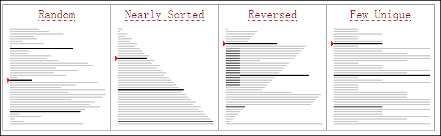

希尔排序
------
#### 算法
  1 shell排序也称递减增量排序。是对插入排序的改进。
  2 插入排序对近似已经排好的序列来说，效率比较高，可以近似达到线性排序的程度。但是插入排序的效率是比较低的，他每次只能向前移动一个位置。
  3 希尔排序通过将待比较元素划分成几个区域来提升插入排序的效率，这样可以使元素向最终位置迈进一大步。之后算法采取越来越小的步长进行排序，但是这个时候元素已经近似成为有序，所以，效率高。
  4
#### 图解

#### 代码实现
```c
//希尔排序
#include <stdio.h>
void Print_Arr(int arr[],int len)
{
    for(int i=0;i<len;i++)
    {
        printf("%4d",arr[i]);
    }
    printf("\n");
    return;
}
void shell_sort(int arr[],int len)
{
    int decount=len/2;
    while(decount>=1)
    {
        //分组进行插入排序
        //0，0+decount,0+2decount为一组
        //1，1+decount
        for(int i=0;i<decount;i++)
        {
            //分好组之后，每组进行插入排序
            for(int j=i+decount;j<len;j+=decount)
            {
                int temp=arr[j];
                for(int k=j-decount;k>=0;k-=decount)
                {
                    if(arr[k]>temp)
                    {
                        arr[k+decount]=arr[k];
                        arr[k]=temp;
                    }
                    else
                    {
                        break;
                    }

                }
            }
        }
        decount/=2;
    }
}
int main() {
    int arr[10]={11,51,58,15,64,95,87,88,14,2};
    int len=sizeof(arr)/ sizeof(int);
    Print_Arr(arr,len);
    shell_sort(arr,len);
    Print_Arr(arr,len);
    printf("Hello, World!\n");
    return 0;
}
```
#### 希尔排序分析
1 希尔排序关键在步长递减序列的确定，任何递减到1的序列都可以，目前已知的比较好的序列有
  + shell序列： ```N/2,N/4 ....,1(重复除以2)```
  + Hibbard序列：```1,3,7,...,2^k-1```
  + Knuth序列：```1,4,13,...(3^k-1)/2```
  + 比较是希尔排序中的主要操作，而不是交换。
