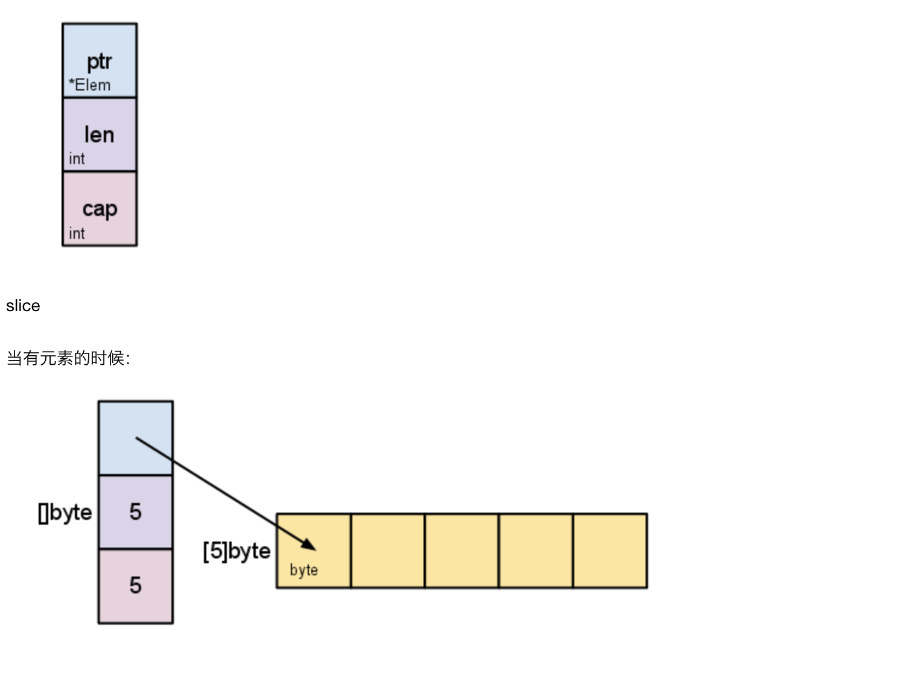

Go语言中必须要注意的小问题

### 语法部分
+ 要生成 Go可执行程序，必须建立一个```main```包，并且要在```main```包中有```main()```函数
+ main()函数不可以带参数，也不能定义返回值
+ 不得包含在源文件中没有使用到的包，否则编译器会报错
+ {}的写法要注意：强制左花括号
+ 如果源文件中有未使用的变量，编译器会报错
+ 函数名大小写规则
+ 全局变量名首字母要大写，局部变量名首字母要小写


### go 全局变量
在函数体外部声明的变量称之为全局变量，全局变量可以在整个包甚至外部包(被导出后使用)，Go语言中，全局变量和局部变量的名称可以相同，但是函数内的局部变量会被优先考虑。
声明全局变量不可以使用：=

### 匿名变量
传统语言中为了接受一个值，却因为该函数返回多个值而不得不定义一堆没有用的变量，go中可以结合多重返回和匿名变量来避免之中丑陋的写法

### 常量
+ 常量是数值类型的：整型、浮点型和复数型、bool类型和字符串型
+ 常量的定义：const
+ 预定义常量：go语言中预定义的下面的常量
  - truefmt.Println("----------iota的注意以及实现------------")
	const(   //const 出现一次，iota自动被重置为0
		v1 = iota   //之后没出现
		v2 = iota
		v3 = iota
		v4 = iota
	)
	fmt.Println(v1,v2,v3,v4)
	const(   //const 出现一次，iota自动被重置为0
		d1 = iota*50   //之后没出现
		d2 = iota*50
		d3 = iota*50
		d4 = iota*50
	)
	fmt.Println(d1,d2,d3,d4)
	const x = iota
	const y = iota
	//z= iota 这种方式是不行的
	fmt.Println(x,y)
	const ( //类似，有点像枚举
		e1 = iota
		e2
		e3
		e4
		)
	fmt.Println(e1,e2,e3,e4)
  - false
  - iota
    - iota是一个比较特殊的，可以被认为是一个可被编译器修改的变量
    - 在每一个const出现时被重置为0
    - 在下一个const出现的之前，每出现一个iota，所代表的数字自动增1
```go
fmt.Println("----------iota的注意以及实现------------")
	const(   //const 出现一次，iota自动被重置为0
		v1 = iota   //之后没出现
		v2 = iota
		v3 = iota
		v4 = iota
	)
	fmt.Println(v1,v2,v3,v4)
	const(   //const 出现一次，iota自动被重置为0
		d1 = iota*50   //之后没出现
		d2 = iota*50
		d3 = iota*50
		d4 = iota*50
	)
	fmt.Println(d1,d2,d3,d4)
	const x = iota
	const y = iota
	//z= iota 这种方式是不行的
	fmt.Println(x,y)
	const ( //类似，有点像枚举
		e1 = iota
		e2
		e3
		e4
		)
	fmt.Println(e1,e2,e3,e4)
```

### 枚举
+ 枚举是指一系列相关的常量，比如下面关于星期的枚举定义
```go
const(
  sunday = iota
  Monday
  Tuesday
  Wednesday
  Thursday
  Friday
  Saturday
  numberOfDays    //这个常量名是私有的
)
```
+ GO语言不支持其他众多语言支持的enum关键字

### Go语言中的类型
+ 基础类型
  - 布尔类型 ```bool```
    - 布尔类型不能接受其他类型的赋值，也不支持自动转换或者强制类型转换

  - 整型    ```int8 byte int16 int uint uintptr ```
    - int和int32在go编译器中被认为是两种不同的变量类型，编译器不会自动转换的，必须自己进行转换
    - 数值运算：go语言中没有前置++--，只有后置的++ --操作
    - 比较运算：go语言中，两个不同类型整型数据是不可以直接比较的，但各种类型的整型变量都是可以与字面常量的(literal)进行比较

  - 浮点类型 ```float32 float64```
    - 因为浮点型不是精准型，所以尽量不要使用浮点型数据来进行比对，这可能会导致不稳定的结果
    - 浮点型自动推导定义中，如果不加小数点，会被自动的推导成为int型数据

  - 复数类型 ```complex64 complex128```
    - 内置的complex用于构建复数
    - 内置的real和imag函数分别返回函数的实部和虚部

  - 字符串   ```string```
    - Go编译器支持```UTF-8```的源代码文件格式，这意味着源代码字符串中可以包含非ANSC的字符
    - 在中国地区是GBK而不是utf-8，所以会出现一些问题
    ```go
    str = "hello world!你好，世界！"
	  str_len = len(str)
	  //utf-8 遍历
	  for i := 0;i<str_len;i++{
		  ch := str[i]
		  fmt.Printf("str[%d]=%s\n",i,string(ch))
	  }
	  //unicode方式遍历
	  for  i,ch := range(str){
		  fmt.Printf("str[%d]=%s\n",i,string(ch))
	  }
    ```
    - 采用下面的unicode方式就可以直接的遍历我们的汉子而不是以UTF-8的方式，出现汉子分片，出现乱码的情况
  - 字符类型 ```rune```
  - 错误类型 ```error```

+ 复合类型
  - 指针(pointer)
    - 1 默认值nil，没有NULL常量
    - 2 操作符“&”取变量地址，“*”通过指针访问目标对象
    - 3 不支持指针运算，不支持“->”运算符，直接用“·”访问目标成员
    - 4 不允许取常量的地址，也不允许修改常量的值
    - 5 new函数
      - 表达式```new(t)```将创建一个new类型的匿名变量
      - new的作用是为T类型的新值分配并清零一块内存空间，然后将这个内存空间的地址作为结果返回。
      - 这个结果就是指向这个新T类型值得指针值，返回的指针类型为*T
      - 使用new函数，不用担心其内存的生命周期以及怎样将其删除，Go语言内存管理系统会帮我们打理一切
    - 6 指针作为函数参数

  - 数组(array)
    - 数组的长度在定义之后是不可以改变的，在声明长度的时候长度可以为一个常量或者常量表达式
    - 数组的长度是该数组的一个内置常量，所以不可以修改，可以使用go语言内置函数go来获取数组的长度
    - range()函数，具有两个返回值，一个是返回数组的下标，第二个是返回元素的值
    - <font color="red">需要注意的是，在go中，数组是一个子类型，所有的值类型的变量在赋值或者是作为函数参数的时候，都将产生一次复制的动作。因此，在函数体内无法修改传入的参数组的内容，因为函数操作的只是传入数组的一个副本</font>
  - 切片(slice)
    - 数组是长度不可变的，而且数组是值传递，这不满足开发的需求
    - 引入切片来弥补数组的不足，以实现变长的案例
    - slice并不是一个真正意义上的动态数组，而是一个引用类型
    - slice总是指向一个底层的array
    - slice声明可以像array一样。只是不需要长度
    - slice的数据结构可以抽象称为下面3个变量
      - 一个指向源生数组的指针
      - 数组切片中的元素的个数
      - 数组切片已经分配的存储空间
      - 
    - 切片的创建和初始化

      ```go
      var s1 []int //声明切片和声明数组时候一样，只不过是没有长度，这样的切片叫做空切片
      s2 := []int{}
      //使用make创建切片，make语法为 make(TYPE,SIZE,LENGTH)
      s3 := make([]int,0) //最后一个为默认值
      fmt.Println(s1,s2,s3)
      s4 :=make([]int,5,5)
      s4[0]=0
      s4[1]=1
      s4[2]=2
      s4[3]=3
      s4[4]=4
      for i:=0;i<len(s4);i++{
        fmt.Println("下标：",i,"值：",s4[i])
      }

      s5 :=[]int{1,2,3}
      for i,v:=range s5{
        fmt.Println("arr",i,"=",v)
      }
      ```

    - 注意：
      - make只可以创建slice、map和channel，并且返回一个初始值(非零)
      - 切片的遍历在go语言中有两种方式：传统方式以及range遍历
    - 內建函数
      - append 添加，末尾添加法
      - copy   复制，以小的len为主

  - 字典(map)
    - map的介绍
      - map是一堆键值对的未排序组合
      - map的定义方式
        - ``` var 变量名 map(key_type)value_type```
        - ```变量名 ：= make(map[key_type]value_type,capacity)可以定义初始化map能力
    - 查找
      - 其他语言中判断能否从map中获取一个值得常规做法是：
        - 声明并初始化一个变量为空
        - 试图从map中获取相应键的值到该变量中
        - 判断该变量是否为空，如果为空则表示该值map中不包含该变量
      - go中的实现```value,ok := map("key")```
    - 内置函数
      - delete 删除容器内的元素
        - delete(map,key)
        - 如果传入的map值是nil，则会抛出异常panic

      -
  - 通道(chan)
  - 结构体(struct)
  - 接口(interface)
+ 注意，对于常规开发，我们使用```int uint```即可，以免造成移植困难
