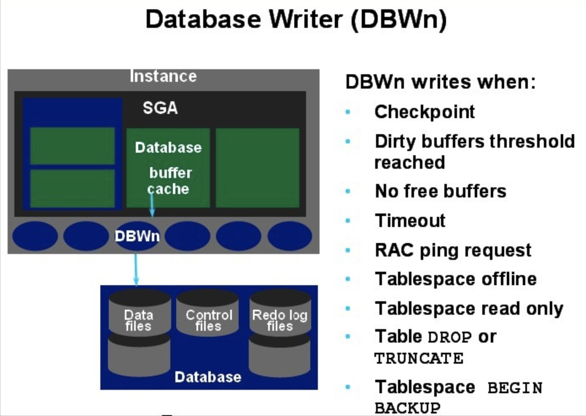
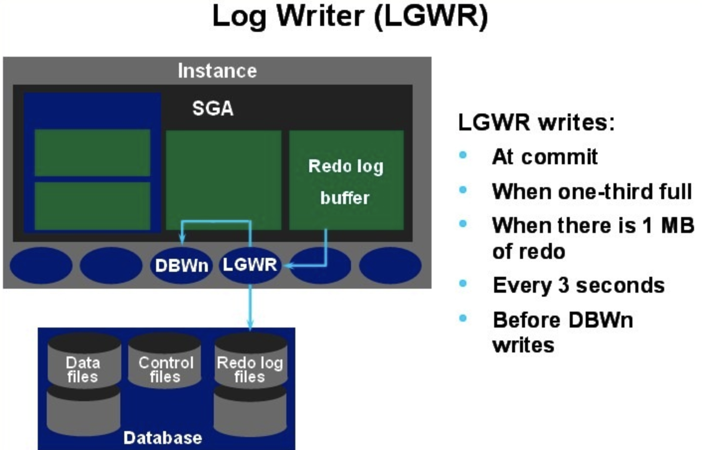

关于数据库
=====

介绍
----
> 数据库的作用: 是为了管理和存储数据，便于程序开发。  
> 常见的数据库:
>>  + oracle
>>  + db2(IBM)
>>  + mysql
>>  + sysbase
>>  + SQLserver
>>  + MongoDB(更灵活)

## 数据库体系架构

   - 逻辑结构
   - 物理结构
   - 实例
### 一 oracle 数据库的逻辑架构
<!--[数据库架构](assets/markdown-img-paste-20180311135118727.png)-->

#### 1.1 Oracle的逻辑结构
      Oracle的逻辑结构是一种层次结构，主要由：表空间，段，区，块等概念组成。逻辑结构主要是面向用户的。

#### 1.2 数据块   

 + 1.2.1 数据块是Oracle的最小存储单位，oracle的数据存放在块中。一个块占用一定的磁盘空间。
>注意： 
> 1 这里的块儿是oracle数据块，不是操作系统块儿. 
> 2 Oracle每次请求数据，都是以块为单位，就是说，每次读取的数据都是块的整数倍，如果数据不够一块，也回按照整块的读取 
> 3 块的标准化大小由初始化参数DB_BLOCK_SIZE指定，块的大小和标准块的大小称为非标准块 
> 4 操作系统执行I/O是以操作系统块为单位，Oracle数据库执行I/O是以Oracle块为单位 
> 5 Oracle数据块的大小一边是操作系统数据块的整数倍 
> 6 Oracle其实就是通过数据块来屏蔽不同操作系统的存储结构的差异，Oracle利用数据块将这些差异加以屏蔽，全部的操作相当于对oracle数据块操作，相当于一个层次的抽象。 
> 7 Oracle所有对数据的操作和空间分配，实际上都是针对数据块Block的操作。我们从数据表中搜索出一行，实际中Oracle就会从内存缓冲区（或者硬盘）中读取到该行所在的数据块，再返回这数据块上的指定数据行。Oracle无论是在缓冲区，还是在硬盘，进行数据操作的虽小单位也就是数据块。 

 + 1.2.2 数据块的格式
<!---->

| 结构     | 功能                                                                                 |
| -------- | ------------------------------------------------------------------------------------ |
| 块头     | 存放块的基本信息,如：块的物理地址，块所属段的类型（数据段还是索引段）。 |
| 表目录   | 存放表的信息，如果一个表的数据被存放在这个块中，这个表的相关信息就被存放在“表目录”中。|
| 行目录   | 如果块中中有行数据存在，那么这些数据会被记录在行目录中，这些信息包括行的地址等等。|
| 自由空间 | 空余空间是一个块中未使用的区域，这片区域用于新行的插入和已经存在的行的更新。|
| 行数据   | 是真正存放表数据和索引数据的地方。这部分空间是已被数据行占用的空间。        |
> 我们把块头、表目录、行目录这三个部分称为头部信息区，头部信息区不存放数据，存放的是整个块的信息。头部的信息区是可以变的，一般来说，头部信息区的大小区介于84B到107B之间
 + 1.2.3 数据库自由空间的使用

| 自由区变动 | 进行的操作           |
| :-------------- |  -------------------------------------------------------------- |
| 自由空间区增加 | DELETE删除块中的记录或者UPDATE把列的值更改成一个更小的值的时候 ，释放空间的时候并不一定是连续的，oracle会在用户insert或者update数据找不到连续空间的时候，才会合并不连续的自由空间。一般来说，合并不连续空间的自由空间会影响数据库的性能|
| 自由空间区减少               | 往数据库区insert或者update数据（使记录长度增加） |

 > 一般来说，对于块中自由空间的使用，oracle一般提供两种管理方式：自动管理和手动管理。

 + 1.2.4 行链接

      如果我们往数据库中插入一行数据，这行数据很大，以至于数据块存不下一整行，Oracle就会把一行数据分成几行存放在几个数据块中，这个过程就叫做行链接，原理图如下
      <!---->
      

 + 1.2.5 行迁移

      数据块中存在一条记录，用户执行UPDATE更新这条记录，这个UPDATE操作使这条记录变长，这时候，Oracle在这个数据块中进行查找，但是找不到能够容纳下这条记录的空间，无奈之下，Oracle只能把整行数据移到一个新的数据块。原来的数据块中保留一个“指针”，这个“指针”指向新的数据块。被移动的这条记录的ROWID保持不变。行迁移的原理如下图所示：
      <!---->
      

  > 注:无论是行链接还是行迁移，都会影响数据库的性能。Oracle在读取这样的记录的时候，Oracle会扫描多个数据块，执行更多的I/O。
+ 1.2.6 数据块自由空间的管理

>块的自动管理：oracle使用位图来管理和跟踪数据库，这种块的空间管理方式就是我们说的自动管理，自动管理有以下的好处
> + 易于管理
> + 更好的利用空间
> + 可以对空间进行实时的管理  

>数据块自由空间的主动管理：用户可以通过PCTFREE, PCTUSED来调整块中空间的使用
> + 相对于自动管理，手动管理方式比较麻烦，不容易掌握，容易造成块中空间的浪费。
> + PCTUSED用于设置一个百分比，当块中已使用的空间的比例小于这个百分比的时候，这个块才被标识为有效状态。只有有效的块才被允许插入数据。
> + PCTFREE参数用于指定块中必须保留的最小空闲空间百分例，默认值为10。之所以要预留这样的空间，是因为UPDATE时，需要这些空间。如果UPDATE时，没有空余空间，Oracle就会分配一个新的块，这会产生行迁移(Row Migrating)。

#### 1.3 数据区
<!---->

 

+ 数据区是一组连续的数据块。
+ 当一个表、回滚段或临时段或需要附加空间时，系统总是为之分配一个新的数据区。
+ 一个数据区不能跨越多个文件，因为他包含了连续的数据块。
+ 使用区是为了保存特定数据类型的数据，也是表中数据增长的基本单位。
+ 一个Oracle对象包含至少一个数据区。设置一个表或索引的存储参数包含设置它的数据区大小。

#### 1.4 数据段

 

+ 数据段与数据对象相对应，一般一个数据对象对应一个数据段。
+ 段是由多个数据区构成的，它是为特定的数据库对象（如表段、索引段、回滚段、临时段）分配的一系列数据区。
+ 段内包含的数据区可以不连续，并且可以跨越多个文件。使用段的目的是用来保存特定对象。
一个Oracle数据库有4种类型的段：
+ 数据段：数据段也称为表段，它包含数据并且与表和簇相关。当创建一个表时，系统自动创建一个以该表的名字命名的数据段。
+ 索引段：包含了用于提高系统性能的索引。一旦建立索引，系统自动创建一个以该索引的名字命名的索引段。
+ 回滚段：包含了回滚信息，并在数据库恢复期间使用，以便为数据库提供读入一致性和回滚未提交的事务，即用来回滚事务的数据空间。当一个事务开始处理时，系统为之分配回滚段，回滚段可以动态创建和撤销。系统有个默认的回滚段，其管理方式既可以是自动的，也可以是手工的。
+ 临时段：它是Oracle在运行过程中自行创建的段。当一个SQL语句需要临时工作区时，由Oracle建立临时段。一旦语句执行完毕，临时段的区间便退回给系统。
#### 1.5 表空间

 

+ 是数据库的逻辑划分。任何数据库对象在存储时都必须存储在某个表空间中。
+ 表空间对应于若干个磁盘文件，即表空间是由一个或多个磁盘文件构成的。
+ 表空间相当于操作系统中的文件夹，也是数据库逻辑结构与物理文件之间的一个映射。
+ 每个数据库至少有一个表空间（system tablespace），表空间的大小等于所有从属于它的数据文件大小的总和。
+ 所以，要想让数据对象访问IO负载均衡，需要指定不同的数据对象在不同的表空间里。这也就是为什么将数据表和索引建立在不同的表空间的原因。

 + 1.5.1 系统表空间
 是每个Oracle数据库都必须具备的。其功能是在系统表空间中存放诸如表空间名称、表空间所含数据文件等数据库管理所需的信息。系统表空间的名称是不可更改的。系统表空间必须在任何时候都可以用，也是数据库运行的必要条件。因此，系统表空间是不能脱机的。
系统表空间包括数据字典、存储过程、触发器和系统回滚段。为避免系统表空间产生存储碎片以及争用系统资源的问题，应创建一个独立的表空间用来单独存储用户数据。
 + 1.5.2 SYSAUX表空间
 是随着数据库的创建而创建的，它充当SYSTEM的辅助表空间，主要存储除数据字典以外的其他对象。SYSAUX也是许多Oracle 数据库的默认表空间，它减少了由数据库和DBA管理的表空间数量，降低了SYSTEM表空间的负荷。
 + 1.5.3 临时表空间
相对于其他表空间而言，临时表空间（temp tablespace）主要用于存储Oracle数据库运行期间所产生的临时数据。数据库可以建立多个临时表空间。当数据库关闭后，临时表空间中所有数据将全部被清除。除临时表空间外，其他表空间都属于永久性表空间。例如dual表就是一个临时表，可以获取系统时间等其他东西。
 + 1.5.4 撤销表空间
 用于保存Oracle数据库撤销信息，即保存用户回滚段的表空间称之为回滚表空间（或简称为RBS撤销表空间（undo tablespace））。在Oracle8i中是rollback tablespace，从Oracle9i开始改为undo tablespace。在Oracle 10g中初始创建的只有6个表空间sysaux、system、temp、undotbs1、example和users。其中temp是临时表空间，undotbs1是undo撤销表空间。
 + 1.5.5 USERS表空间
 用户表空间，用于存放永久性用户对象的数据和私有信息。每个数据块都应该有一个用户表空间，以便在创建用户是将其分配给用户。

      实例+数据库组成
      客户端向数据库发送请求
      oracle数据库管理系统，通过各种的数据，依赖我们服务器的各种服务，之后在内存中完成相关的请求响应，这样的我们叫做实例（instance） =服务+内存
      数据存放在磁盘之中
      请求提交给PGA(程序全局区)---之后提交给SGA（系统全局区---之后SGA到DB（数据库区）中去那我们要用的数据

      数据库中有两个以上的实例，我们叫做集群。集群可以提高并发访问量，提高访问的效率。
      另外的是提高我们数据库系统的安全性

      表空间和数据文件
      逻辑上讲：表空间是由多个数据文件组成，位于实例上的，这个是在我们的内存中的。我们实例真正
      操作的是表空间
      物理上讲：我们的数据文件是位于磁盘上(dbf)
              三个文件：控制文件、日志文件和数据文件

      表空间 段  区  块之间的关系
      表空间是有段组成，段是区的集合，区是数据块的集合，数据块会被映射到磁盘上
### 二 物理结构
  - 数据文件
  - 日志文件
  - 控制文件

#### 2.1 数据文件
+ 每一个ORACLE数据库有一个或多个物理的数据文件(data file)。
+ 一个数据库的数据文件包含全部数据库数据。
+ 逻辑数据库结构(如表、索引)的数据物理地存储在数据库的数据文件中。数据文件有下列特征：
  + 一个数据文件仅与一个数据库联系。
  + 一旦建立，数据文件不能改变大小.

+ 一个表空间（数据库存储的逻辑单位）由一个或多个数据文件组成。
+ 数据文件中的数据在需要时可以读取并存储在ORACLE内存储区中。
>>例如：用户要存取数据库一表的某些数据，如果请求信息不在数据库的内存存储区内，则从相应的数据文件中读取并存储在内存。当修改和插入新数据时，不必立刻写入数据文件。为了减少磁盘输出的总数，提高性能，数据存储在内存，然后由ORACLE后台进程DBWR决定如何将其写入到相应的数据文件。

#### 2.2 日志文件
+ 每一个数据库有两个或多个日志文件（redo log file）的组，每一个日志文件组用于收集数据库日志。
+ 日志的主要功能是记录对数据所作的修改，所以对数据库作的全部修改是记录在日志中。在出现故障时，如果不能将修改数据永久地写入数据文件，则可利用日志得到该修改，所以从不会丢失已有操作成果。
+ 日志文件主要是保护数据库以防止故障。为了防止日志文件本身的故障，ORACLE允许镜象日志(mirrored redo log)，以致可在不同磁盘上维护两个或多个日志副本。
+ 日志文件中的信息仅在系统故障或介质故障恢复数据库时使用，这些故障阻止将数据库数据写入到数据库的数据文件。然而任何丢失的数据在下一次数据库打开时，ORACLE自动地应用日志文件中的信息来恢复数据库数据文件。

+ Oralce两种日志文件类型：
  + 联机日志文件：这是Oracle用来循环记录数据库改变的操作系统文件
  + 归档日志文件：这是指为避免联机日志文件重写时丢失重复数据而对联机日志文件所做的备份，Oracle有两种归档日志模式，Oracle数据库可以采用其中任何一种模式：
    + NOARCHIVELOG：不对日志文件进行归档。这种模式可以大大减少数据库备份的开销，但可能回导致数据的不可恢复
    + ARCHIVELOG：在这种模式下，当Oracle转向一个新的日志文件时，将以前的日志文件进行归档。为了防止出现历史“缺口”的情况，一个给定的日志文件在它成功归档之前是不能重新使用的。归档的日志文件，加上联机日志文件，为数据库的所有改变提供了完整的历史信息。

+ 在Oracle利用日志文件和归档日志文件来恢复数据库时，内部序列号可以起一个向导的作用。
#### 2.3 控制文件
+ 每一ORACLE数据库有一个控制文件(control file)，它记录数据库的物理结构，包含下列信息类型：
    + 数据库名；
    + 数据库数据文件和日志文件的名字和位置；
    + 数据库建立日期。
+ 为了安全起见，允许控制文件被镜象。
+ 每一次ORACLE数据库的实例启动时，它的控制文件用于标识数据库和日志文件，当着手数据库操作时它们必须被打开。
+ 当数据库的物理组成更改时，ORACLE自动更改该数据库的控制文件。数据恢复时，也要使用控制文件。
### 三 实例
数据库实例（也称为服务器Server）就是用来访问一个数据库文件集的一个存储结构及后台进程的集合。它使一个单独的数据库可以被多个实例访问（也就是ORACLE并行服务器-- OPS）。

实例在操作系统中用ORACLE_SID来标识，在Oracle中用参数INSTANCE_NAME来标识， 它们两个的值是相同的。数据库启动时，系统首先在服务器内存中分配系统全局区（SGA），构成了Oracle的内存结构，然后启动若干个常驻内存的操作系统进程，即组成了Oracle的 进程结构，内存区域和后台进程合称为一个Oracle实例。

 

#### 3.1 系统全局区（SGA)
SGA是一组为系统分配的共享的内存结构，可以包含一个数据库实例的数据或控制信:  息。如果多个用户连接到同一个数据库实例，在实例的SGA中，数据可以被多个用户共享， 当数据库实例启动时，SGA的内存被自动分配；当数据库实例关闭时，SGA内存被回收。  SGA是占用内存最大的一个区域，同时也是影响数据库性能的重要因素。
##### 3.1.1 数据块缓存区
数据块缓存区(datablockbuffercache)是SGA中的一个高速缓存区域，用来存储从数据库中读取数据段的数据块(如表、索引和簇)。数据块缓存区的大小由数据库服务器init.ora文件中的DB_LOCK_BUFFERS参数决定(用数据库块的个数表示)。在调整和管理数据库时，调整数据块缓存区的大小是一个重要的部分。

因为数据块缓存区的大小固定，并且其大小通常小于数据库段所使用的空间，所以它不能一次装载下内存中所有的数据库段。通常，数据块缓存区只是数据库大小的1%～2%，Oracle使用最近最少使用(LRU，leastrecentlyused)算法来管理可用空间。当存储区需要自由空间时，最近最少使用块将被移出，新数据块将在存储区代替它的位置。通过这种方法，将最频繁使用的数据保存在存储区中。

然而，如果SGA的大小不足以容纳所有最常使用的数据，那么，不同的对象将争用数据块缓存区中的空间。当多个应用程序共享同一个SGA时，很有可能发生这种情况。此时，每个应用的最近使用段都将与其他应用的最近使用段争夺SGA中的空间。其结果是，对数据块缓存区的数据请求将出现较低的命中率，导致系统性能下降。
##### 3.1.2 字典缓存区
数据库对象的信息存储在数据字典表中，这些信息包括用户帐号数据、数据文件名、段名、盘区位置、表说明和权限，当数据库需要这些信息(如检查用户查询一个表的授权)时，将读取数据字典表并且将返回的数据存储在字典缓存区的SGA中。

数据字典缓存区通过最近最少使用(LRU)算法来管理。字典缓存区的大小由数据库内部管理。字典缓存区是SQL共享池的一部分，共享池的大小由数据库文件init.ora中的SHARED_POOL_SIZE参数来设置。

如果字典缓存区太小，数据库就不得不反复查询数据字典表以访问数据库所需的信息，这些查询称为循环调用(recuesivecall)，这时的查询速度相对字典缓存区独立完成查询时要低。
##### 3.1.3 重做日志缓冲区
重做项描述对数据库进行的修改。它们写到联机重做日志文件中，以便在数据库恢复过程中用于向前滚动操作。然而，在被写入联机重做日志文件之前，事务首先被记录在称作重做日志缓冲区(redologbuffer)的SGA中。数据库可以周期地分批向联机重做日志文件中写重做项的内容，从而优化这个操作。重做日志缓冲区的大小(以字节为单位)由init.ora文件中的LOG_BUFFER参数决定。
##### 3.1.4 SQL共享池
SQL共享池存储数据字典缓存区及库缓存区(librarycache)，即对数据库进行操作的语句信息。当数据块缓冲区和字典缓存区能够共享数据库用户间的结构及数据信息时，库缓存区允许共享常用的SQL语句。

SQL共享池包括执行计划及运行数据库的SQL语句的语法分析树。在第二次运行(由任何用户)相同的SQL语句时，可以利用SQL共享池中可用的语法分析信息来加快执行速度。

SQL共享池通过LRU算法来管理。当SQL共享池填满时，将从库缓存区中删掉最近最少使用的执行路径和语法分析树，以便为新的条目腾出空间。如果SQL共享池太小，语句将被连续不断地再装入到库缓存区，从而影响操作性能。

SQL共享池的大小(以字节为单位)由init.ora文件参数SHARED_POOL_SIZE决定。

##### 3.1.5 大池
大池(LargePool)是一个可选内存区。如果使用线程服务器选项或频繁执行备份/恢复操作，只要创建一个大池，就可以更有效地管理这些操作。大池将致力于支持SQL大型命令。利用大池，就可以防止这些SQL大型命令把条目重写入SQL共享池中，从而减少再装入到库缓存区中的语句数量。大池的大小(以字节为单位)通过init.ora文件的LARGE_POOL_SIZE参数设置，用户可以使用init.ora文件的LARGE_POOL_MIN_ALLOC参数设置大池中的最小位置。Oracle8i已不用这个参数。作为使用LargePool的一种选择方案，可以用init.ora文件的SHARED_POOL_RESERVED_SIZE参数为SQL大型语句保留一部分SQL共享池。
##### 3.1.6 Java池
由其名字可知，Java池为Java命令提供语法分析。Java池的大小(以字节为单位)通过在Oracle8i引入的init.ora文件的JAVA_POOL_SIZE参数设置。init.ora文件的JAVA_POOL_SIZE参数缺省设置为10MB。

##### 3.1.7 多缓冲池
可以在SGA中创建多个缓冲池，能够用多个缓冲池把大数据集与其他的应用程序分开，以减少它们争夺数据块缓存区内相同资源的可能性。对于创建的每一个缓冲池，都要规定其LRU锁存器的大小和数量。缓冲区的数量必须至少比LRU锁存器的数量多50倍。

创建缓冲池时，需要规定保存区(keeparea)的大小和再循环区(recyclearea)的大小。与SQL共享池的保留区一样，保存区保持条目，而再循环区则被频繁地再循环使用。可以通过BUFFER_POOL_KEEP参数规定来保存区的大小。例如：
保存和再循环缓冲池的容量减少了数据块缓冲存储区中的可用空间(通过DB_BLOCK_BUFFERS参数设置)。对于使用一个新缓冲池的表，通过表的storage子句中的buffer_pool参数来规定缓冲池的名字。例如，如果需要从内存中快速删除一个表，就把它赋予RECYCLE池。缺省池叫作DEFAULT，这样就能在以后用altertable命令把一个表转移到DEFAULT池。

#### 3.2 后台进程（Backgroung Process）
##### 3.2.1 DBWR进程

 
该进程执行将缓冲区写入数据文件，是负责缓冲存储区管理的一个Oracle后台进程。当缓冲区中的一缓冲区被修改，它被标志为“弄脏”，DBWR的主要任务是将“弄脏”的缓冲区写入磁盘，使缓冲区保持“干净”。由于缓冲存储区的缓冲区填入数据库或被用户进程弄脏，未用的缓冲区的数目减少。当未用的缓冲区下降到很少，以致用户进程要从磁盘读入块到内存存储区时无法找到未用的缓冲区时，DBWR将管理缓冲存储区，使用户进程总可得到未用的缓冲区。

Oracle采用LRU（LEAST RECENTLY USED）算法（最近最少使用算法）保持内存中的数据块是最近使用的，使I/O最小。在下列情况预示DBWR 要将弄脏的缓冲区写入磁盘：

当一个服务器进程将一缓冲区移入“弄脏”表，该弄脏表达到临界长度时，该服务进程将通知DBWR进行写。该临界长度是为参数DB-BLOCK-WRITE-BATCH的值的一半。

当一个服务器进程在LRU表中查找DB-BLOCK-MAX-SCAN-CNT缓冲区时，没有查到未用的缓冲区，它停止查找并通知DBWR进行写。出现超时（每次3秒），DBWR 将通知本身。当出现检查点时，LGWR将通知DBWR.在前两种情况下，DBWR将弄脏表中的块写入磁盘，每次可写的块数由初始化参数DB-BLOCK- WRITE-BATCH所指定。如果弄脏表中没有该参数指定块数的缓冲区，DBWR从LUR表中查找另外一个弄脏缓冲区。

如果DBWR在三秒内未活动，则出现超时。在这种情况下DBWR对LRU表查找指定数目的缓冲区，将所找到任何弄脏缓冲区写入磁盘。每当出现超时，DBWR查找一个新的缓冲区组。每次由DBWR查找的缓冲区的数目是为寝化参数DB-BLOCK- WRITE-BATCH的值的二倍。如果数据库空运转，DBWR最终将全部缓冲区存储区写入磁盘。

在出现检查点时，LGWR指定一修改缓冲区表必须写入到磁盘。DBWR将指定的缓冲区写入磁盘。

在有些平台上，一个实例可有多个DBWR.在这样的实例中，一些块可写入一磁盘，另一些块可写入其它磁盘。参数DB-WRITERS控制DBWR进程个数。
##### 3.2.2 LGWR进程

 
该进程将日志缓冲区写入磁盘上的一个日志文件，它是负责管理日志缓冲区的一个Oracle后台进程。LGWR进程将自上次写入磁盘以来的全部日志项输出，LGWR输出：

  + 当用户进程提交一事务时写入一个提交记录。
  + 每三秒将日志缓冲区输出。
  + 当日志缓冲区的1/3已满时将日志缓冲区输出。
  + 当DBWR将修改缓冲区写入磁盘时则将日志缓冲区输出。
  LGWR进程同步地写入到活动的镜象在线日志文件组。如果组中一个文件被删除或不可用，LGWR可继续地写入该组的其它文件。

日志缓冲区是一个循环缓冲区。当LGWR将日志缓冲区的日志项写入日志文件后，服务器进程可将新的日志项写入到该日志缓冲区。LGWR 通常写得很快，可确保日志缓冲区总有空间可写入新的日志项。
>注意：有时候当需要更多的日志缓冲区时，LWGR在一个事务提交前就将日志项写出，而这些日志项仅当在以后事务提交后才永久化。

ORACLE使用快速提交机制，当用户发出COMMIT语句时，一个COMMIT记录立即放入日志缓冲区，但相应的数据缓冲区改变是被延迟，直到在更有效时才将它们写入数据文件。当一事务提交时，被赋给一个系统修改号（SCN），它同事务日志项一起记录在日志中。由于SCN记录在日志中，以致在并行服务器选项配置情况下，恢复操作可以同步。 
##### 3.2.3 CKPT进程
该进程在检查点出现时，对全部数据文件的标题进行修改，指示该检查点。在通常的情况下，该任务由LGWR执行。然而，如果检查点明显地降低系统性能时，可使CKPT进程运行，将原来由LGWR进程执行的检查点的工作分离出来，由CKPT进程实现。对于许多应用情况，CKPT进程是不必要的。只有当数据库有许多数据文件，LGWR在检查点时明显地降低性能才使CKPT运行。 CKPT进程不将块写入磁盘，该工作是由DBWR完成的。初始化参数CHECKPOINT-PROCESS控制CKPT进程的使能或使不能。缺省时为FALSE，即为使不能。
+ 完全检查点： 在Oracle8i之前，数据库的发生的检查点都是完全检查点，完全检查点会将数据缓冲区里面所有的脏数据块写入相应的数据文件中，并且同步数据文件头和控制文件，保证数据库的一致。完全检查点在8i之后只有在下列两种情况下才会发生：
  + DBA手工执行alter system checkpoint的命令；
  + 数据库正常shutdown（immediate,transcational,normal）。

  由于完全检查点会将所有的脏数据库块写入，巨大的IO往往会影响到数据库的性能。因此Oracle从8i开始引入了增量检查点的概念。
+ 增量检查点： 
Oracle从8i开始引入了检查点队列这么一种概念，用于记录数据库里面当前所有的脏数据块的信息，DBWR根据这个队列而将脏数据块写入到数据文件中。检查点队列按时间先后记录着数据库里面脏数据块的信息，里面的条目包含RBA（Redo Block Address，重做日志里面用于标识检查点期间数据块在重做日志里面第一次发生更改的编号）和数据块的数据文件号和块号。在检查点期间不论数据块更改几次，它在检查点队列里面的位置始终保持不变，检查点队列也只会记录它最早的RBA，从而保证最早更改的数据块能够尽快写入。当DBWR将检查点队列里面的脏数据块写入到数据文件后，检查点的位置也要相应地往后移，CKPT每三秒会在控制文件中记录检查点的位置，以表示Instance Recovery时开始恢复的日志条目，这个概念称为检查点的“心跳”（heartbeat）。检查点位置发生变更后，Oracle里面通过4个参数用于控制检查点位置和最后的重做日志条目之间的距离。在这里面需要指出的是，多数人会将这4个参数看作控制增量检查点发生的时间。事实上这是错误的，这4个参数是用于控制检查点队列里面的条目数量，而不是控制检查点的发生。
  + fast_start_io_target： 该参数用于表示数据库发生Instance Recovery的时候需要产生的IO总数，它通过v$filestat的AVGIOTIM来估算的。比如我们一个数据库在发生Instance Crash后需要在10分钟内恢复完毕，假定OS的IO每秒为500个，那么这个数据库发生Instance Recovery的时候大概将产生500*10*60=30,000次IO，也就是我们将可以把fast_start_io_target设置为30000。
  + fast_start_mttr_target： 我们从上面可以看到fast_start_io_target来估算检查点位置比较麻烦。Oracle为了简化这个概念，从9i开始引入了fast_start_mttr_target这么一个参数，用于表示数据库发生Instance Recovery的时间，以秒为单位。这个参数我们从字面上也比较好理解，其中的mttr是mean time to recovery的简写，如上例中的情况我们可以将fast_start_mttr_target设置为600。当设置了fast_start_mttr_target后，fast_start_io_target这个参数将不再生效，从9i后fast_start_io_target这个参数被Oracle废除了。
  + log_checkpoint_timeout： 该参数用于表示检查点位置和重做日志文件末尾之间的时间间隔，以秒为单位，默认情况下是1800秒。
  + log_checkpoint_interval： 该参数是表示检查点位置和重做日志末尾的重做日志块的数量，以OS块表示。
  + 90% OF SMALLEST REDO LOG： 除了以上4个初始化参数外，Oracle内部事实上还将重做日志文件末尾前面90%的位置设为检查点位置。在每个重做日志中，这么几个参数指定的位置可能不尽相同，Oracle将离日志文件末尾最近的那个位置确认为检查点位置。
+ SMON进程 该进程实例启动时，执行实例恢复，还负责清理不再使用的临时段。在具有并行服务器选项的环境下，SMON对有故障CPU或实例进行实例恢复。SMON进程有规律地被呼醒，检查是否需要，或者其它进程发现需要时可以被调用。
+ PMON进程 该进程在用户进程出现故障时执行进程恢复，负责清理内存储区和释放该进程所使用的资源。例：它要重置活动事务表的状态，释放封锁，将该故障的进程的ID从活动进程表中移去。PMON还周期地检查调度进程（DISPATCHER）和服务器进程的状态，如果已死，则重新启动（不包括有意删除的进程）。 PMON有规律地被呼醒，检查是否需要，或者其它进程发现需要时可以被调用。
+ RECO进程 该进程是在具有分布式选项时所使用的一个进程，自动地解决在分布式事务中的故障。一个结点RECO后台进程自动地连接到包含有悬而未决的分布式事务的其它数据库中，RECO自动地解决所有的悬而不决的事务。任何相应于已处理的悬而不决的事务的行将从每一个数据库的悬挂事务表中删去。 当一数据库服务器的RECO后台进程试图建立同一远程服务器的通信，如果远程服务器是不可用或者网络连接不能建立时，RECO自动地在一个时间间隔之后再次连接。 RECO后台进程仅当在允许分布式事务的系统中出现，而且DISTRIBUTED C TRANSACTIONS参数是大于0。
+ ARCH进程 该进程将已填满的在线日志文件拷贝到指定的存储设备。当日志是为ARCHIVELOG使用方式、并可自动地归档时ARCH进程才存在。
+ LCKn进程 是在具有并行服务器选件环境下使用，可多至10个进程（LCK0，LCK1……，LCK9），用于实例间的封锁。
+ Dnnn进程（调度进程） 该进程允许用户进程共享有限的服务器进程（SERVER PROCESS）。没有调度进程时，每个用户进程需要一个专用服务进程（DEDICATEDSERVER PROCESS）。对于多线索服务器（MULTI-THREADED SERVER）可支持多个用户进程。如果在系统中具有大量用户，多线索服务器可支持大量用户，尤其在客户_服务器环境中。

在一个数据库实例中可建立多个调度进程。对每种网络协议至少建立一个调度进程。数据库管理员根据操作系统中每个进程可连接数目的限制决定启动的调度程序的最优数，在实例运行时可增加或删除调度进程。多线索服务器需要SQL \*NET版本2或更后的版本。在多线索服务器的配置下，一个网络接收器进程等待客户应用连接请求，并将每一个发送到一个调度进程。如果不能将客户应用连接到一调度进程时，网络接收器进程将启动一个专用服务器进程。该网络接收器进程不是Oracle实例的组成部分，它是处理与Oracle有关的网络进程的组成部分。在实例启动时，该网络接收器被打开，为用户连接到Oracle建立一通信路径，然后每一个调度进程把连接请求的调度进程的地址给予它的接收器。当一个用户进程作连接请求时，网络接收器进程分析请求并决定该用户是否可使用一调度进程。如果是，该网络接收器进程返回该调度进程的地址，之后用户进程直接连接到该调度进程。有些用户进程不能调度进程通信（如果使用SQL\*NET以前的版本的用户），网络接收器进程不能将此用户连接到一调度进程。在这种情况下，网络接收器建立一个专用服务器进程，建立一种合适的连接。
##### 3.2.4
##### 3.2.5
##### 3.2.6

参考资料
-----
请各位遵循 [Markdown: License][license] 及其它参考文献的共享协议来使用、修改和发布。

[ORACLE体系结构](http://blog.csdn.net/sinat_33363493/article/details/51782609)
