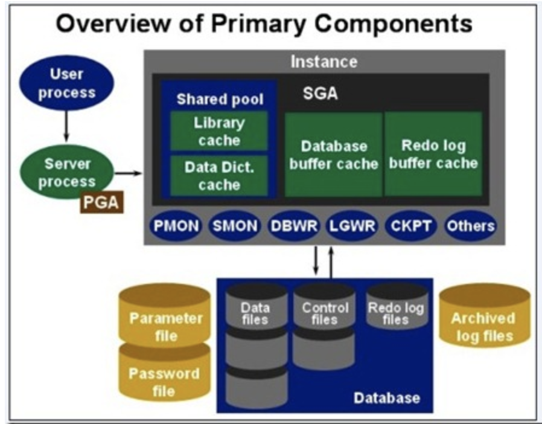
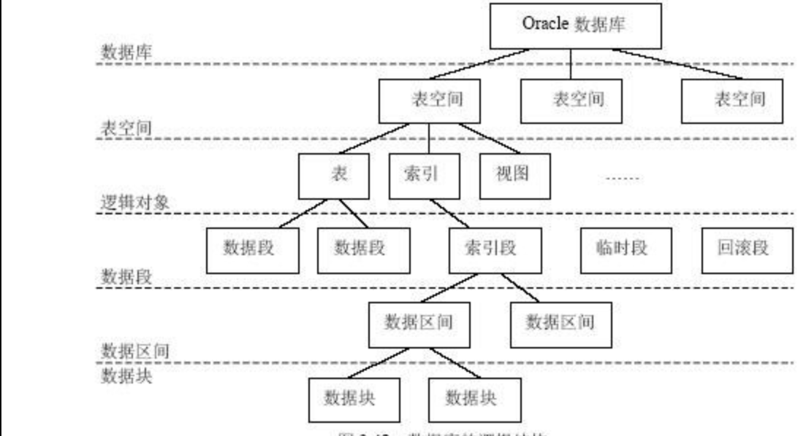

关于数据库
=====

介绍
----
> 数据库的作用: 是为了管理和存储数据，便于程序开发。  
> 常见的数据库:
>>  + oracle
>>  + db2(IBM)
>>  + mysql
>>  + sysbase
>>  + SQLserver
>>  + MongoDB(更灵活)

## 一 数据库体系架构
### oracle 数据库的架构
      + 逻辑结构
      + 物理结构
      + 实例

#### 1.1 Oracle的逻辑结构
      Oracle的逻辑结构是一种层次结构，主要由：表空间，段，区，块等概念组成。逻辑结构主要是面向用户的。

**数据库逻辑结构**

      实例+数据库组成
      客户端向数据库发送请求
      oracle数据库管理系统，通过各种的数据，依赖我们服务器的各种服务，之后在内存中完成相关的请求响应，这样的我们叫做实例（instance） =服务+内存
      数据存放在磁盘之中
      请求提交给PGA(程序全局区)---之后提交给SGA（系统全局区---之后SGA到DB（数据库区）中去那我们要用的数据

      数据库中有两个以上的实例，我们叫做集群。集群可以提高并发访问量，提高访问的效率。
      另外的是提高我们数据库系统的安全性

      表空间和数据文件
      逻辑上讲：表空间是由多个数据文件组成，位于实例上的，这个是在我们的内存中的。我们实例真正
      操作的是表空间
      物理上讲：我们的数据文件是位于磁盘上(dbf)
              三个文件：控制文件、日志文件和数据文件

      表空间 段  区  块之间的关系
      表空间是有段组成，段是区的集合，区是数据块的集合，数据块会被映射到磁盘上
