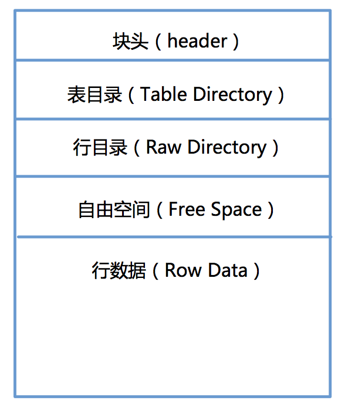
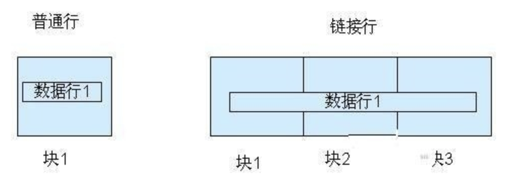
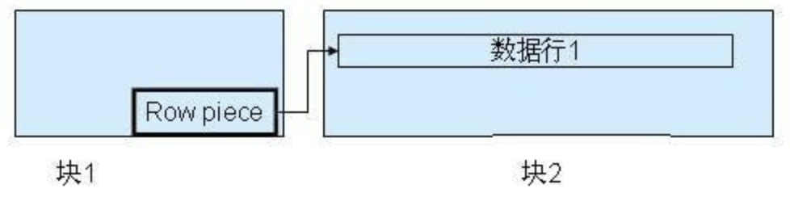
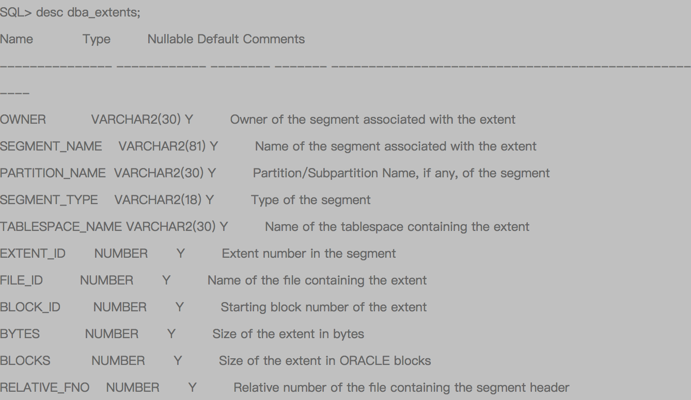
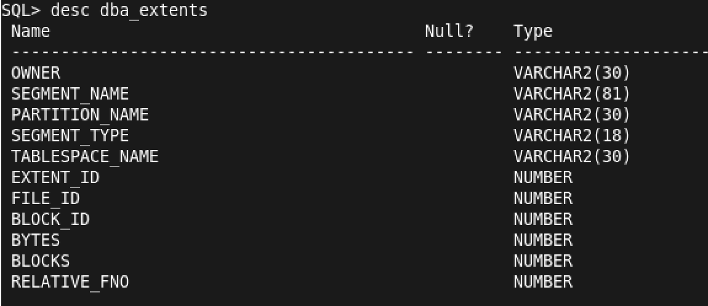
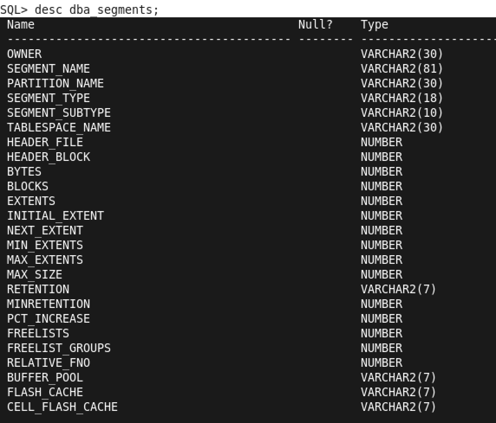
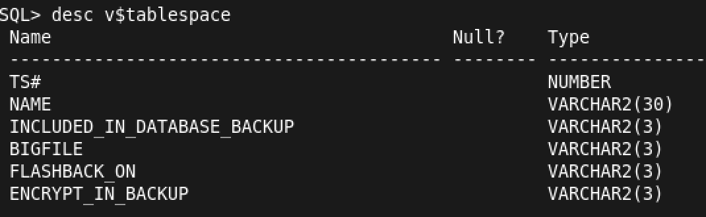

关于数据库
=====

介绍
----
> 数据库的作用: 是为了管理和存储数据，便于程序开发。  
> 常见的数据库:
>>  + oracle
>>  + db2(IBM)
>>  + mysql
>>  + sysbase
>>  + SQLserver
>>  + MongoDB(更灵活)

## 数据库体系架构

   - 逻辑结构
   - 物理结构
   - 实例
### 一 oracle 数据库的逻辑架构
<!--[数据库架构](assets/markdown-img-paste-20180311135118727.png)-->

#### 1.1 Oracle的逻辑结构
      Oracle的逻辑结构是一种层次结构，主要由：表空间，段，区，块等概念组成。逻辑结构主要是面向用户的。

#### 1.2 数据块   

 + 1.2.1 数据块是Oracle的最小存储单位，oracle的数据存放在块中。一个块占用一定的磁盘空间。
>注意： 
> 1 这里的块儿是oracle数据块，不是操作系统块儿. 
> 2 Oracle每次请求数据，都是以块为单位，就是说，每次读取的数据都是块的整数倍，如果数据不够一块，也回按照整块的读取 
> 3 块的标准化大小由初始化参数DB_BLOCK_SIZE指定，块的大小和标准块的大小称为非标准块 
> 4 操作系统执行I/O是以操作系统块为单位，Oracle数据库执行I/O是以Oracle块为单位 
> 5 Oracle数据块的大小一边是操作系统数据块的整数倍 
> 6 Oracle其实就是通过数据块来屏蔽不同操作系统的存储结构的差异，Oracle利用数据块将这些差异加以屏蔽，全部的操作相当于对oracle数据块操作，相当于一个层次的抽象。 
> 7 Oracle所有对数据的操作和空间分配，实际上都是针对数据块Block的操作。我们从数据表中搜索出一行，实际中Oracle就会从内存缓冲区（或者硬盘）中读取到该行所在的数据块，再返回这数据块上的指定数据行。Oracle无论是在缓冲区，还是在硬盘，进行数据操作的虽小单位也就是数据块。 

 + 1.2.2 数据块的格式
<!---->

| 结构     | 功能                                                                                 |
| -------- | ------------------------------------------------------------------------------------ |
| 块头     | 存放块的基本信息,如：块的物理地址，块所属段的类型（数据段还是索引段）。 |
| 表目录   | 存放表的信息，如果一个表的数据被存放在这个块中，这个表的相关信息就被存放在“表目录”中。|
| 行目录   | 如果块中中有行数据存在，那么这些数据会被记录在行目录中，这些信息包括行的地址等等。|
| 自由空间 | 空余空间是一个块中未使用的区域，这片区域用于新行的插入和已经存在的行的更新。|
| 行数据   | 是真正存放表数据和索引数据的地方。这部分空间是已被数据行占用的空间。        |
> 我们把块头、表目录、行目录这三个部分称为头部信息区，头部信息区不存放数据，存放的是整个块的信息。头部的信息区是可以变的，一般来说，头部信息区的大小区介于84B到107B之间
 + 1.2.3 数据库自由空间的使用

| 自由区变动 | 进行的操作           |
| :-------------- |  -------------------------------------------------------------- |
| 自由空间区增加 | DELETE删除块中的记录或者UPDATE把列的值更改成一个更小的值的时候 ，释放空间的时候并不一定是连续的，oracle会在用户insert或者update数据找不到连续空间的时候，才会合并不连续的自由空间。一般来说，合并不连续空间的自由空间会影响数据库的性能|
| 自由空间区减少               | 往数据库区insert或者update数据（使记录长度增加） |

 > 一般来说，对于块中自由空间的使用，oracle一般提供两种管理方式：自动管理和手动管理。

 + 1.2.4 行链接

      如果我们往数据库中插入一行数据，这行数据很大，以至于数据块存不下一整行，Oracle就会把一行数据分成几行存放在几个数据块中，这个过程就叫做行链接，原理图如下
      <!---->
      

 + 1.2.5 行迁移

      数据块中存在一条记录，用户执行UPDATE更新这条记录，这个UPDATE操作使这条记录变长，这时候，Oracle在这个数据块中进行查找，但是找不到能够容纳下这条记录的空间，无奈之下，Oracle只能把整行数据移到一个新的数据块。原来的数据块中保留一个“指针”，这个“指针”指向新的数据块。被移动的这条记录的ROWID保持不变。行迁移的原理如下图所示：
      <!---->
      

  > 注:无论是行链接还是行迁移，都会影响数据库的性能。Oracle在读取这样的记录的时候，Oracle会扫描多个数据块，执行更多的I/O。
+ 1.2.6 数据块自由空间的管理

>块的自动管理：oracle使用位图来管理和跟踪数据库，这种块的空间管理方式就是我们说的自动管理，自动管理有以下的好处
> + 易于管理
> + 更好的利用空间
> + 可以对空间进行实时的管理  

>数据块自由空间的主动管理：用户可以通过PCTFREE, PCTUSED来调整块中空间的使用
> + 相对于自动管理，手动管理方式比较麻烦，不容易掌握，容易造成块中空间的浪费。
> + PCTUSED用于设置一个百分比，当块中已使用的空间的比例小于这个百分比的时候，这个块才被标识为有效状态。只有有效的块才被允许插入数据。
> + PCTFREE参数用于指定块中必须保留的最小空闲空间百分例，默认值为10。之所以要预留这样的空间，是因为UPDATE时，需要这些空间。如果UPDATE时，没有空余空间，Oracle就会分配一个新的块，这会产生行迁移(Row Migrating)。

#### 1.3 数据区
<!---->

 

+ 数据区是一组连续的数据块。
+ 当一个表、回滚段或临时段或需要附加空间时，系统总是为之分配一个新的数据区。
+ 一个数据区不能跨越多个文件，因为他包含了连续的数据块。
+ 使用区是为了保存特定数据类型的数据，也是表中数据增长的基本单位。
+ 一个Oracle对象包含至少一个数据区。设置一个表或索引的存储参数包含设置它的数据区大小。

#### 1.4 数据段

 

+ 数据段与数据对象相对应，一般一个数据对象对应一个数据段。
+ 段是由多个数据区构成的，它是为特定的数据库对象（如表段、索引段、回滚段、临时段）分配的一系列数据区。
+ 段内包含的数据区可以不连续，并且可以跨越多个文件。使用段的目的是用来保存特定对象。
一个Oracle数据库有4种类型的段：
+ 数据段：数据段也称为表段，它包含数据并且与表和簇相关。当创建一个表时，系统自动创建一个以该表的名字命名的数据段。
+ 索引段：包含了用于提高系统性能的索引。一旦建立索引，系统自动创建一个以该索引的名字命名的索引段。
+ 回滚段：包含了回滚信息，并在数据库恢复期间使用，以便为数据库提供读入一致性和回滚未提交的事务，即用来回滚事务的数据空间。当一个事务开始处理时，系统为之分配回滚段，回滚段可以动态创建和撤销。系统有个默认的回滚段，其管理方式既可以是自动的，也可以是手工的。
+ 临时段：它是Oracle在运行过程中自行创建的段。当一个SQL语句需要临时工作区时，由Oracle建立临时段。一旦语句执行完毕，临时段的区间便退回给系统。
#### 1.5 表空间

 

+ 是数据库的逻辑划分。任何数据库对象在存储时都必须存储在某个表空间中。
+ 表空间对应于若干个磁盘文件，即表空间是由一个或多个磁盘文件构成的。
+ 表空间相当于操作系统中的文件夹，也是数据库逻辑结构与物理文件之间的一个映射。
+ 每个数据库至少有一个表空间（system tablespace），表空间的大小等于所有从属于它的数据文件大小的总和。
+ 所以，要想让数据对象访问IO负载均衡，需要指定不同的数据对象在不同的表空间里。这也就是为什么将数据表和索引建立在不同的表空间的原因。

 + 1.5.1 系统表空间
 是每个Oracle数据库都必须具备的。其功能是在系统表空间中存放诸如表空间名称、表空间所含数据文件等数据库管理所需的信息。系统表空间的名称是不可更改的。系统表空间必须在任何时候都可以用，也是数据库运行的必要条件。因此，系统表空间是不能脱机的。
系统表空间包括数据字典、存储过程、触发器和系统回滚段。为避免系统表空间产生存储碎片以及争用系统资源的问题，应创建一个独立的表空间用来单独存储用户数据。
 + 1.5.2 SYSAUX表空间
 是随着数据库的创建而创建的，它充当SYSTEM的辅助表空间，主要存储除数据字典以外的其他对象。SYSAUX也是许多Oracle 数据库的默认表空间，它减少了由数据库和DBA管理的表空间数量，降低了SYSTEM表空间的负荷。
 + 1.5.3 临时表空间
相对于其他表空间而言，临时表空间（temp tablespace）主要用于存储Oracle数据库运行期间所产生的临时数据。数据库可以建立多个临时表空间。当数据库关闭后，临时表空间中所有数据将全部被清除。除临时表空间外，其他表空间都属于永久性表空间。例如dual表就是一个临时表，可以获取系统时间等其他东西。
 + 1.5.4 撤销表空间
 用于保存Oracle数据库撤销信息，即保存用户回滚段的表空间称之为回滚表空间（或简称为RBS撤销表空间（undo tablespace））。在Oracle8i中是rollback tablespace，从Oracle9i开始改为undo tablespace。在Oracle 10g中初始创建的只有6个表空间sysaux、system、temp、undotbs1、example和users。其中temp是临时表空间，undotbs1是undo撤销表空间。
 + 1.5.5 USERS表空间
 用户表空间，用于存放永久性用户对象的数据和私有信息。每个数据块都应该有一个用户表空间，以便在创建用户是将其分配给用户。

      实例+数据库组成
      客户端向数据库发送请求
      oracle数据库管理系统，通过各种的数据，依赖我们服务器的各种服务，之后在内存中完成相关的请求响应，这样的我们叫做实例（instance） =服务+内存
      数据存放在磁盘之中
      请求提交给PGA(程序全局区)---之后提交给SGA（系统全局区---之后SGA到DB（数据库区）中去那我们要用的数据

      数据库中有两个以上的实例，我们叫做集群。集群可以提高并发访问量，提高访问的效率。
      另外的是提高我们数据库系统的安全性

      表空间和数据文件
      逻辑上讲：表空间是由多个数据文件组成，位于实例上的，这个是在我们的内存中的。我们实例真正
      操作的是表空间
      物理上讲：我们的数据文件是位于磁盘上(dbf)
              三个文件：控制文件、日志文件和数据文件

      表空间 段  区  块之间的关系
      表空间是有段组成，段是区的集合，区是数据块的集合，数据块会被映射到磁盘上
### 二 物理结构
  - 数据文件
  - 日志文件
  - 控制文件

#### 2.1 数据文件
#### 2.2 日志文件
#### 2.3 控制文件

### 三 实例

参考资料
-----
请各位遵循 [Markdown: License][license] 及其它参考文献的共享协议来使用、修改和发布。

[ORACLE体系结构](http://blog.csdn.net/sinat_33363493/article/details/51782609)
