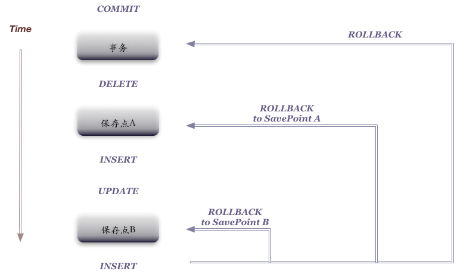

目标：
-----
+ <a href="#H-1">1 多表查询编写</a>
+ <a href="#H-2">2 子查询编写</a>
+ <a href="#H-3">3 集合运算</a>
+ <a href="#H-4">4 数据的增删改操作</a>
+ <a href="#H-5">5 事务</a>
+ <a href="#H-6">6 表的操作和管理</a>

## <a name="H-1">一 多表查询</a>
+ 1.1 笛卡尔积就是

```
  a{1,2,3} b{3,2,1} a*b={(1,1,),(1,2,),(1,3),(2,1),(2,2),(2,3)}
```

  就是两个集合形成一个序列对集合
  对于两个表的笛卡尔积，我们需要一个过滤条件，对于n个表的笛卡尔积，我们需要n-1个条件进行过滤
  在sql中多表查询，笛卡尔积采用的是交叉连接，生成临时的笛卡尔积表

+ 1.2 内连接：可以这么理解，俩个表先采用交叉连接，再通过加上限制条件（sql中通过加上on关键字），剔除掉
      不符合要求的行得到的子集，得到的结果就是内连接。
+ 1.3 等值链接： 我们只用两个表中的公共的项目，可以最后实现我们的等值链接，通过一个等值的数据对我们的
      笛卡尔集的表进行相关的筛选。
```sql
    SELECT e.empno,e.ename,e.sal,d.dname
    from emp e, dept d
    WHERE e.deptno=d.deptno
    ORDER BY d.dname;
```

>统计不同部门的人数

```sql
    SELECT d.deptno,d.dname,COUNT(e.empno)
    FROM dept d,emp e
    WHERE d.deptno=e.deptno
    GROUP BY d.deptno,d.dname;
```
+ 1.4 不等值链接：
      可以根据范围进行相关的筛选</br>
```sql
    SELECT e.empno,e.ename,e.sal,s.grade FROM emp e, salgrade s WHERE e.sal>=s.losal and e.sal<=s.hisal;
```
+ 1.5 左外链接

+ 1.6 右外链接
      要显示右边的数据，那么需要在左边的等号的时候加上（+）
      e表的部门编号比较少，d表的比较多，所以要在e表后面加
```sql
    SELECT d.deptno,d.dname,COUNT(e.empno)
    FROM dept d,emp e
    WHERE e.deptno(+)=d.deptno
    GROUP BY d.DEPTNO,d.DNAME
    ORDER BY d.DEPTNO;
```
      对count(*)和count(e.empno)的区别：
      count（*）只要一行不为空，可以是多个列不为空，有一行列不为空，那就不为空
      count（e.empno）：只有e.empno不为空，才会被统计上

+ 1.7 自查询
     就是与自己进行多表查询，之后就可以实现相关的查询
```sql
    SELECT e.ename||'的老板是'||nvl(b.ename,'his wife')
    FROM emp e,emp b
    where e.mgr=b.empno(+);
```

## <a name="H-2">二 子查询（sql嵌套sql)</a>
```sql
    SELECT * from emp where sal>(SELECT sal FROM emp where ename='SCOTT');
```

+ 2.1 关于子查询的十点注意事项
  + 2.1.1 合理的书写风格：要合理的进行相应的换行、缩进
  + 2.1.2 使用小括号
  + 2.1.3 主查询和子查询可以是不同的表，只要子查询返回的值主查询可以使用就可以
  + 2.1.4 可以在主查询的where 、select、 having、from后面放置子查询
  ```sql
  SELECT empno,ename,deptno,(SELECT dname FROM dept where deptno=10)from emp where deptno=10;
  ```
  having 后面增加子查询
  ```sql
  SELECT deptno,avg(sal) FROM emp  GROUP BY deptno HAVING avg(sal)>(SELECT avg(sal) from emp WHERE deptno=30 GROUP by deptno);
  ```
  + 2.1.5 一个select查询的结果可以看成一个表，在from后面可以直接使用
  + 2.1.6 不可以在主查询的group by后面放置子查询（sql语法规范）
  + 2.1.7 单行子查询只可以使用单行操作符，多行子查询可以使用多行操作符
      多行操作符有In，any all
  + 2.1.8 一般不在子查询中使用order by,但是在top-N问题中，我们必须使用order by
  + 2.1.9 一般先采用子查询（内查询），在执行主查询（外查询），但是相关子查询除外
  +2.1.10 子查询中的NULL值
## <a name="H-3">三 集合运算</a>
+ union 两个集合相同的部分保留一部分
+ union all 两个集合相同的部分都保留
+ intersect 两个集合交集：只保留两个集合相同的部分
+ minus 集合A-集合B，从A中减去A与B相同的部分，只保留A中与B不的部分。
  + 3.1 实例</br>
    + 3.1.1 查看部门号为10的表和部门号在（10，20）之间的记录的union集合，并按部门号排序。
    ```sql
    SELECT * FROM (SELECT* FROM emp WHERE deptno=10 UNION SELECT * FROM emp WHERE deptno in (10,20)) ORDER BY deptno ;
    ```
    + 3.1.2 保留上述共同部分的语句
    ```sql
    SELECT * FROM (SELECT * FROM emp WHERE deptno=10 UNION ALL SELECT * FROM emp WHERE deptno in (10,20)) ORDER BY deptno;
    ```
    + 3.1.3 求共同部分
    ```sql
    SELECT * FROM emp WHERE deptno in (10,30) INTERSECT SELECT * FROM emp WHERE deptno in (10,20);
    ```
    + 3.1.4 剔除相同的部分
    ```sql
    SELECT * FROM emp WHERE deptno in (10,20) MINUS SELECT * FROM emp WHERE deptno in (10,30);
    ```
    + 3.1.5 按照部门统计各部门不同工种的工资情况。
      + 第一步，按照deptno和job进行分组，查询deptno、job、sum(sal)
      + 第二步，数据直接按照deptno分组即可，与job无关，select只需查找deptno、sum(sal)
      + 第三步，数据不按任何条件分组，即group by null;select 查询sum(sal);
    ```sql
    SELECT deptno,job ,sum(sal) FROM emp GROUP BY deptno,job
    UNION SELECT deptno,TO_CHAR(null),SUM(sal) FROM emp GROUP by deptno
    UNION SELECT TO_NUMBER(null),TO_CHAR(null),SUM(sal) FROM emp ;
    ```

  + 3.2注意事项：
    + 3.2.1 union表达式中，前后检索的列必须数据类型一致，列数要一致。
      + 错误语法
      ```sql
      SELECT deptno,ename FROM emp WHERE conditon1 UNION SELECT ename ,deptno FROM emp WHERE conditon2
      ```
      + 正确语法
      ```sql
      SELECT deptno,ename FROM emp WHERE conditon1 UNION SELECT deptno,ename FROM emp WHERE conditon2
      ```
    + 3.2.2 集合的运算性能一般比较大
## <a name="H-4">四 数据库DML 增删查改</a>
+ 4.1 insert 操作</br>

    语法:

    ```sql
    insert into tablename （col1,col2,col3....） values (val1,val2,val3...);
    ```
   - 示例
      + 全部列插入
      ```sql
      INSERT into dept values(53,'53name','53loc');
      ```
      + 部分列插入(隐式插入null)
      ```sql
      INSERT INTO dept(deptno,dname) VALUES(10,'accouting');
      ```
      + 显式插入null
      ```sql
      INSERT INTO dept(deptno,dname,loc) VALUES(10,'accouting',null);
      ```
      + \&符号的使用（类似于c语言中的宏替换）
      ```sql
      INSERT INTO dept VALUES(&a,'&b','&c');
      ```
      oracle之后会要求你输入相关变量的值，完成插入操作。
      + 拷贝表的结构
        + 拷贝整个表，包括数据
        ```sql
        CREATE TABLE dept_03_13 as SELECT * FROM dept;
        ```
        + 只拷贝表结构，不拷贝数据，可以在建表的后面增加一条条件语句，只要条件永远为假，那么就没有数据完成匹配，就只会拷贝表结构。
        ```sql
        CREATE TABLE dept_03_13 AS SELECT * FROM dept   WHERE 1=2;
        ```
      + 批量插入
        ```sql
        CREATE TABLE dept_03_15 as SELECT deptno, dname FROM dept WHERE 1=2;
        INSERT INTO dept_03_15 SELECT deptno,dname FROM dept;
        SELECT * FROM dept_03_15;
        ```
+ 4.2 update 操作

  语法：</br>
    ```sql
    update table_name set col1=val1,col2=val2,col3=val3...where conditon
    ```
    + 示例
      + 更新表中的某个记录
      ```sql
        INSERT INTO EMP VALUES(7966,'TOM_CAT','CLERK',NULL,NULL,1500,NULL,30);
        UPDATE emp set sal=sal+100 WHERE ename='TOM_CAT';
        SELECT * FROM EMP WHERE ename='TOM_CAT;'
      ```
    + 注意：
      + update的时候。可以使用sal=null的格式
      + 使用update时，一定要加where条件，否则会修改表里面的所有数据
+ 4.3 delete 操作/truncate
delete语法：</br>
  ```sql
  delete from table_name where condition1 ...
  ```
   + 示例
     + 从emp表中删除TOM_CAT的员工记录
   ```sql
   DELETE FROM emp WHERE ename='TOM_CAT';
   ```

    + 注意：
      + 使用delete时，一定要加where条件，否则会修改表里面的所有数据
    + delete和truncate的区别
      + delete逐条删除表中的内容，truncate是先将表毁掉，之后再重新建立表。（由于delete使用频繁，oracle在对delete优化后，delete快于truncate）
      + delete是DML语句，truncate是DDL语句。DML语句可以闪回， DDL语句不可以闪回（闪回，一个操作错误之后并且commit之后，对应的撤回的行为）。
      + 由于delete是逐条操作语句，所以delete操作会产生碎片，truncate不会产生碎片。
        两个数据之间的数据被删除，删除的数据一一碎片，整理碎片，数据连续，行移动。
      + delete不会释放空间，truncate会释放空间。所以，delete可以回滚数据，而truncate是不可以回滚，确认表不在使用，可以使用truncate直接删除。
      + delete可以回滚rollback，truncate不可以回滚数据。


+ 4.3 批量的生成一个sql插入一个长10000的数据，之后查看delete和truncate的区别。

  + [shell脚本](Learning-Document/Learning_Database/oracle-operate/code/test.sh)，执行命令重定向后，生成一个批量插入数据的sql脚本。
  + 在oracle中执行sql脚本
    - @ sql脚本所在路径/脚本
    - start 脚本
  + 使用delete删除数据。

  + 使用truncate删除数据。

## <a name="H-5">五 事务相关 </a>
+ 事务的概念：

  - 事务， 是由有限的数据库操作序列组成的逻辑执行单元。这一系列的操作要不全部执行，要不全部放弃执行。
  - 事务的组成
    - 一个或者多个DML语句
    - 一个DDL语句
    - 一个DCL语句
  - 事务的特点，要不全部成功，要不全部失败。
  - 事务开始和结束
    - 开始：事务以DML语句开始，执行一系列的数据插入或者修改操作
    - 结束：
      - 1 提交结束:commit</br>
          隐私提交：执行DDL语句（如执行一个create表操作），正常退出
      - 2 显式回滚：rollback</br>
          隐式回滚：断电，宕机，异常退出等等。

  - 事务的特性：ACID
    - 原子性(Atom)：事务的原子性是指事务中的全部操作是不可分割的，要不全部完成，要不均不执行
    - 一致性(Consistency)：几个并行执行的事务，其执行的结果必须按某一执行顺序串行执行的结果相一致。
    - 隔离性(Isolation)：事务的执行不可以被其他的事务干扰，当数据库被几个客户端并发访问时，需要隔离操作，防止：脏读、幻读、不可重复读。
    - 持久性(Durability)：对任意已提交的事务，系统必须保证该事务对数据库的改变不被丢失，即使数据库出现故障。
+ 5.2 事务的控制--保存点
  + 保存点就是类似于游戏存档，事务的保存点，为了防止错误操作影响整个事务，方便进行事务的控制。
  <center></center></br>

  + 保存点的使用
    - 新建表
    ```sql
    CREATE TABLE testsp(tid number, tname varchar(20));
    ```
    - 设置回显
    ```sql
    set feedback on
    ```
    - 插入数据
    ```sql
    INSERT INTO testsp VALUES(1,'TOM');
    INSERT INTO testsp VALUES(1,'LUCY');
    ```
    - 设置保存点aaa
    ```sql
    savepoint aaa;
    ```
    - 插入数据，更改数据。先查看一下表中的情况。
    ```sql
    SELECT * from testsp;
    INSERT INTO testsp VALUES(3,'wang');
    UPDATE testsp set tname='LILI' WHERE tid=3;
    ```
    - 回滚到保存点aaa
    ```sql
    rollback to savepoint aaa;
    select * from testsp;
    ```
    - 回滚到事务一开始
    ```sql
    rollback;
    ```
  >注意：</br>
  > <font color="grey">1 前俩次的操作依然没有commit掉，我们如果需要</font></br>
  > <font color="grey">2 savepoint主要用于在事务上下文中声明一个中间标记，将一个长事务分割成多个较小的部分，和我们在编辑文档时候习惯性的保存一下，都是为了防止出错和丢失。</font></br>
  > <font color="grey">3 如果保存点重复，就会删除之前的那个保存点</font></br>
  > <font color="grey">4 一旦commit后，savepoint就会失效</font></br>
+ 5.3 隔离级别
  + 为什么有要隔离
    - 对于同时运行的多个事务，这些事务在访问数据库的时候，如果没有采取合理的隔离机制，会出现各种问题：
      - 脏读：对于两个事务，T1，T2，T1读取了被T2更新了但是还没有提交的数据，之后如果T2回滚，T1读取的内容是临时且无效的。
      - 不可重复读取：对于两个事务，T1，T2，T1读取了一个字段，然后T2更新了该字段，之后T1再读该字段，值就不同了
      - 幻读：对于两个事务，T1，T2,T1从一个表中读取了一个字段，T2在该表中插入了一些新的行，之后，如果T1再次读取同一个表，就会多出几行。
  + 数据库事务的隔离性：数据库必须具有隔离并发运行各个事务的能力，使他们不会相互影响，避免各种并发问题。
  + 隔离级别：一个事务与其他事务隔离的程度称为隔离级别。数据库定义了多种事务隔离级别，不同的级别对应不同法人干扰程度，隔离级别越高，数据一致性越好，但并发性越弱。
  + SQL99定义四种隔离级别<font color="#2C2728">
    - Read Uncommitted  读未提交数据
    - Read Commited     读已提交数据
    - Repeatable Read   可重复读
    - Serialzable       序列化，串行化    </font>
  + oracle支持隔离级别：Read Commited（默认），Serialzable以及oracle自己定义的Read Only 三种
    - Read Only 大多数情况下，在事务的操作过程中，不希望别人也来操作，但是如果Serialzable串行执行的话，单线程会导致数据库性能太差。所以这个时候是可以允许别人来进行Read操作的。
## <a name="H-6">四 事务相关 </a>
+ 6.1 常见的数据库对象
  + 表、视图、索引、序列、同义词
    - 表 基本的数据存储集合，有行和列组成
    - 视图 从表中抽出逻辑上的相关的数据集合
    - 序列 提供有规律的数值
    - 索引 提高查询的效率
    - 同义词 给对象起别名
  + 存储过程、存储函数、触发器、包、包体、数据库链路(datalink)、快照
+ 6.2 表的基本操作
    - 表的基本操作
  >注意：</br>
  > <font color="grey">1 必须以字母开头</font></br>
  > <font color="grey">2 必须在1-30个字符之间</font></br>
  > <font color="grey">3 必须只能包含A-Z，a-z，0-9，_，$，和#</font></br>
  > <font color="grey">4 必须不能和用户定义的其他对象重名</font></br>
  > <font color="grey">5 必须不能是Oracle的保留字</font></br>
  >  <font color="grey">6 Oracle默认存储是存为大写字</font></br>
  >  <font color="grey">7 数据库名只能是1~8位，datalink可以是128位，和其他一些特殊字符</font></br>
+ 6.3 创建表
  - 创建一张表必须具备：
    - 1 Create Table的权限；
    - 2 存储空间。例子中的scott/hr用户都具备这两点
  - 创建表的时候，列所用的数据类型</br>

| 数据类型         | 描述                                 |
| ---------------- | ------------------------------------ |
| varchar2(size)   | 可变长字符数据                       |
| char(size)       | 定长字符数据                         |
| number(p,s)      | 可变长数值数据                       |
| date             | 日期型数据                           |
| long             | 可变长支付数据，最长可达2G           |
| clob             | 字符数据，最长金可达4G               |
| raw and long raw | 原始的二进制数据                     |
| blob             | 二进制数据，最大可达4G               |
| bfile            | 存储外部文件的二进制数据，最大可达4G |
| ROWID            | 行地址                  |
>row-id 行地址--伪列
  ```sql
  SELECT ROWID,ename, deptno,sal FROM emp;
  ```
> 查询该语句可以rowid列存储的是一系列的地址（指针），创建索引时候回用到。

  - 创建表
    - 默认创建
    ```sql
    CREATE TABLE emp_self (tid number, tname varchar(20));
    ```
    - 拷贝建表
    1 只拷贝表结构，利用where条件为假，未能初始表的序列
    ```sql
    CREATE TABLE emp_self as SELECT * from emp where 1=2;
    ```
    2 部分拷贝，利用where为真，之后部分初始化
    ```sql
    CREATE TABLE emp_self as SELECT * from emp WHERE deptno=20;
    ```
    3 拷贝建表，复制一份表
    ```sql
    CREATE TABLE emp_self as SELECT * from emp;
    ```
    4 可以通过拷贝重新给表的列命名，可以进行表的移植和迁移等工作。
    ```sql
    CREATE TABLE emp_self as SELECT ename e1name,hiredate hdate,emono no from emp;
    ```

  - 表的修改
    -
