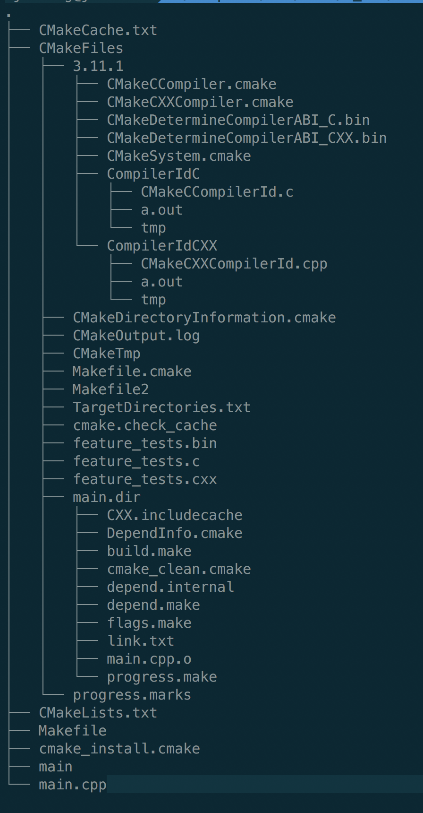

cmake的基本使用
============

### <span id='title_01'>单个源文件使用cmake编译</span>
+ 这一节我们是从简单的hello world入手</br>
  源文件
  
  ```c++
  #include <iostream>
  using namespace std;
  int main()
  {
	   cout<<"hello world"<<endl;
	   return 1;
  }
  ```

+ 我们的目录结构

  ```
  .
    ├── CMakeLists.txt
    └── main.cpp
  ```

+ 编写我们的cmakelist.txt文件
  并保存在我们main.cpp同根文件夹下面，下面是我们的CMakeLists.txt

  ```txt
  #项目名称
  project(main)
  #最低版本要求
  cmake_minimum_required(VERSION 2.8)
  #指定生成目标
  add_executable(main main.cpp)
  ```

+ 在项目文件夹下执行```cmake .```，生成makefile
  ```txt
  -- The C compiler identification is AppleClang 9.1.0.9020039
  -- The CXX compiler identification is AppleClang 9.1.0.9020039
  -- Check for working C compiler: /Library/Developer/CommandLineTools/usr/bin/cc
  -- Check for working C compiler: /Library/Developer/CommandLineTools/usr/bin/cc -- works
  -- Detecting C compiler ABI info
  -- Detecting C compiler ABI info - done
  -- Detecting C compile features
  -- Detecting C compile features - done
  -- Check for working CXX compiler: /Library/Developer/CommandLineTools/usr/bin/c++
  -- Check for working CXX compiler: /Library/Developer/CommandLineTools/usr/bin/c++ -- works
  -- Detecting CXX compiler ABI info
  -- Detecting CXX compiler ABI info - done
  -- Detecting CXX compile features
  -- Detecting CXX compile features - done
  -- Configuring done
  -- Generating done
  -- Build files have been written to: /Users/jiewang/computer/C++/code/c_c++/test06
  ```
+ 使用make得到我们要生成的```main```文件
  ```txt
  Scanning dependencies of target main
  [ 50%] Building CXX object CMakeFiles/main.dir/main.cpp.o
  [100%] Linking CXX executable main
  [100%] Built target main
  ```
  
+ 执行```./main```即可执行编译后的生成文件
