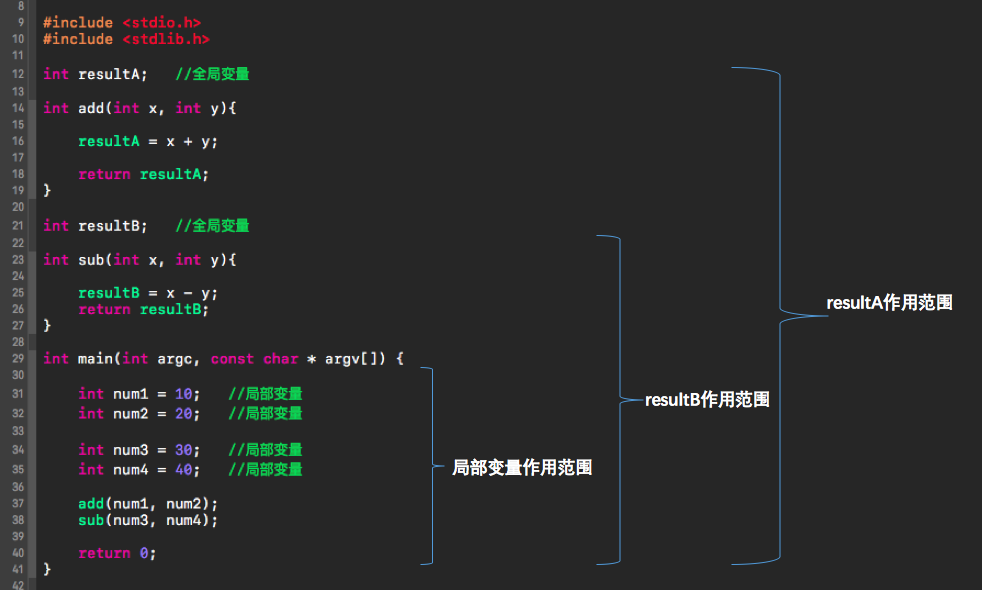
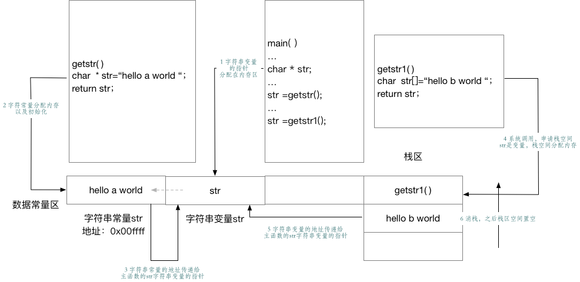
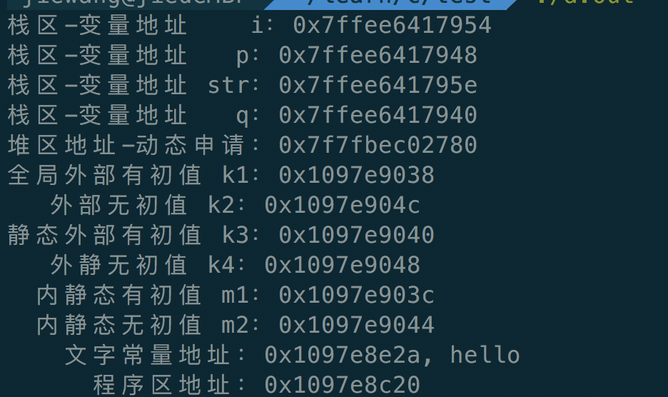
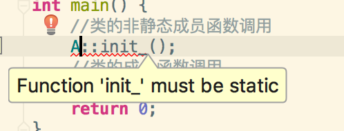
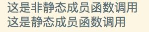
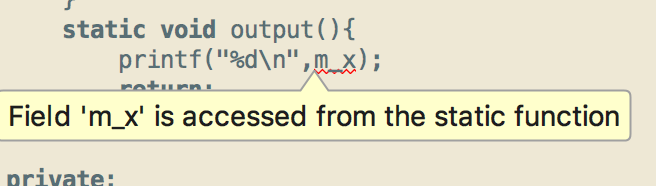

## 六 内存、堆、栈、变量作用域和生存期


### c逻辑进程的内存分区模型
+ 概览
<!---->
<center></center>

| 内存分区                     | 功能                                                                                                                                                                                                                                                                                                                                                                                      |
| ---------------------------- | ----------------------------------------------------------------------------------------------------------------------------------------------------------------------------------------------------------------------------------------------------------------------------------------------------------------------------------------------------------------------------------------- |
| 程序代码区（code data）      | 存放函数体的二进制代码                                                                                                                                                                                                                                                                                                                                                                    |
| 静态数据区（data area）      | 也称全局数据区，包含的数据类型比较多，如：全局变量、静态变量、一般常量、字符串常量等。                                                                                                                                                                                                                                                                                                    |
| 初始化的全局变量和静态变量区 | <font color='red'> 字符串常量是存放在静态数据区的常量区的，这部分内容是不许被修改的                                                                                                                                                                                                                                                                                                       |
| 未初始化的全局变量和静态变量 | <font color='red'> 注： 静态变量的内存是进程结束后由操作系统释放 </font>                                                                                                                                                                                                                                                                                                                  |
| 堆（heap）                   | 1 一般是由程序员分配和释放，若程序员不释放，进程结束后由操作系统自动释放，如，malloc*()，calloc（），free（）等 </br> 2 堆具有“大内存，手工分配，申请大小随意，可能会泄露等特点”</br>3 堆内存是由os分配给堆管理器来管理了，堆管理器向使用者（用户进程）提供API来使用堆内存。</br>4 堆需要程序员自己释放，如果程序员在申请堆内存并使用后没有来得及释放，那么这块内存就丢失了，这就是我们说的内存泄露 |
| 栈区(stack)                  | 1 由操作系统自动分配释放，存放函数的参数值、局部变量的值。</br>2 栈作为内存中的存储存储结构，通常存放程序临时创建的局部变量，即大括号{}中定义的变量，其中还包括函数调用的时候其形参，返回值等。</br>3 栈的大小是有默认值的，如果申请的临时变量太大超过栈的大小，就会造成栈溢出。  </br>4 关于进程栈、线程栈以及linux中堆和栈的、进程和线程的区别，我们可以参考下面的文档。[]()                                                                      |
| 命令行参数区                 | 存放命令行参数和环境变量的值，如，通过main()函数传递的值                                                             |

+ 具体变量在内存分区中的模型
  ```c
  #include<stdio.h>
  int a=0;                            //=======>全局初始化变量区
  char p1;                            //=======>全局未初始化变量区

  int main(int argc, char const *argv[]) {
    int b;                            //=======>栈区
    char s[]="abc";                   //=======>栈区
    char p2;                          //=======>栈区
    char p3="123456";                 //=======>123456在常量区，p3在栈区
    static c=0;                       //=======>全局（静态）初始化区
    d1=(char)malloc(10);              //=======>分配10字节的区域就在堆区
    d2=(char)malloc(20);              //=======>分配20字节的区域就在堆区
    printf("%p\n",p1);
    printf("%p\n",p2);
    return 0;
  }


### 静态数据区
+ 变量的作用域
<!---->
<center></center>


+ 局部变量和静态局部变量
+ 字符串常量和字符串变量
  - c语言中，在一个双引号 “” 内的字符序列或者转义字符序列称为字符串变量。
    <font color='grey'>例如："HA HA" "abc" "\n\t"</font>
    这些字符串常量是不允许改变的，如果试图改变指针所指向位置的值是错误的。
    ```c
    char * str="hello world";
    * str='h';//操作是不允许的，会编译报警，执行报错；
    ```
  - c中没有纯粹的字符串变量，可以通过一个字符数组来实现。
    ```c
    char str[]="hello world";
    * str='h';//可以修改，相当于修改str第一个指针指向的内存的值。
    ```
  - 一个对比
    ```c
       #include<stdio.h>
       int main()
      {
        char * str="hello world";
        printf("%s\n",str);
        * str='C';
        printf("%s\n",str);
        return 1;
      }
      //编译报警，执行会报错，不可以更改常量区的值
    ```
    ```c
    #include <stdio.h>
    int main()
    {
      char str[]="hello world";
      printf("%s\n",str);
      * str='C';
      printf("%s\n",str);
      return 1;
    }
    //可以修改，执行成功。数组存放在
    ```
  - 字符串变量究竟存放在什么地方
    ```c
    #include<stdio.h>
    char * getstr()
    {
      char *str="hello a world";
      //字符串常量，存放在静态数据区，编译的时候由编译器分配。
      return str;
    }

    char * getstr1()
    {
    char str[]="hello b world"//字符串变量，函数调用时候，有栈来分配字符串变量的内存。
    printf("%d,%s\n",(int)str,str);
    return  str;
    }

    int main()
    {
    char * str=NULL;
    str=getstr();//我们将字符常量的地址给了我们自己定义的字符串指针，指向我们静态区的地址，实现了静态区数据的读取
    printf("%s\n",str);
    //尝试改写静态数据区的数据
    * str='C';
    printf("%s\n",str)
    //程序执行报错 21311 bus error，不允许修改相关的内容
    str=getstr1();//调用getstr1函数，获取里面生成数组的地址
    printf("%d,%s\n",(int)str,str);
    //捕获到函数内字符串变量的地址
    //无法打印出相关的内容，这是因为在函数调用完成后，给函数分配的栈空间会被回收。相应的字符串分配的内存也被回收，所以无法打印出内容。
    //尝试修改改地址的内容。
    * str='c';
    printf("%d,%s\n",(int)str,str);
    //修改失败，说明栈的生长也是由系统分配的，程序是没有权限直接越界访问内存的。
    return 1;
    }
    ```
    <!---->
    <center></center>

### 内存泄露

### c语言的内存分配函数
+ malloc
  - 函数原型： ```void *malloc(size_t __size)  ```
  - 参数说明： ```size```是所需要分配内存的空间大小，是指字节
  - 返回值类型： ```void *``` 表示未确定返回值的类型
               成功： 返回指向该内存的地址
               失败： 返回NULL
    <font color='grey'>注：c，c++规定，```void *```可强制转换成任何其他类型的指针。</font>
  - 函数功能: 表示向系统申请分配指定 size 个字节的内存空间
  - eg:
    ```c
    int *a = malloc(4);  //申请4个字节的空间用于存放一个int类型的值
    char *b = malloc(2); //申请2个字节的空间用于存放一个char类型的值
    ```
+ calloc
  - 函数原型： ```void *calloc(size_t __count, size_t __size)```
  - 参数说明： ```size```是单位个需要分配内存的空间大小，是指字节。```count```表示个数。
  - 返回值类型： ```void *``` 表示未确定返回值的类型
              成功： 返回指向该内存的地址
              失败： 返回NULL

  - 函数功能: 表示向系统申请分配 count 个长度为 size 一共为 count 乘以 size 个字节长度的连续内存空间，并将每一个字节都初始化为 0
  - eg:
    ```c
    int *c = calloc(10, sizeof(int)); 申请10个sizeof(int) 字节的空间
    char *d = calloc(2, sizeof(char)); 申请10个sizeof(char) 字节的空间
    ```
+ calloc
  - 函数原型： ```void *realloc(void *__ptr, size_t __size))```
  - 参数说明： ```size```是单位个需要分配内存的空间大小，是指字节。```ptr```表示需要修改的内存空间地址。
  - 返回值类型： ```void *``` 表示未确定返回值的类型
              成功： 返回指向该内存的地址
              失败： 返回NULL

  - 函数功能: 表示更改已经配置好的内存空间到指定的大小
  - eg:
    ```c
    char *d = calloc(2, sizeof(char));  //申请2个sizeof(char) 字节的空间
    char *f = realloc(d, 5 * sizeof(char));  //将原来变量d指向的2个sizeof(char) 字节的空间更改到5个sizeof(char) 字节的空间并由变量f指向。
    ```
+ free
  - 函数原型：```void free(void *)```
  - 参数说明：```void *```表示需要释放的内存空间对应的内存地址。
  - 返回值类型：返回值为空。
  - 函数功能：```free```表示用来释放已经动态分配的内存空间。```free()``` 可以释放由``` malloc()```、```calloc()```、```realloc()``` 分配的内存空间，以便其他程序再次使用。
  - eg：
    ```c
    char *g = malloc(sizeof(char)); //申请sizeof(char)大小内存空间
    free(g);      //释放掉g指针指向的内存空间
    g = NULL;     //将g指针指向NULL
    ```
  - <font color='grey'>注意：
    - free() 不会改变 传入的指针的值，调用 free() 后它仍然会指向相同的内存空间，但是此时该内存已无效，不能被使用。所以建议将释放完的指针设置为 NULL。</br>
    - free()只能释放动态分配的内存，并不能释放任意分配的内存。</font>
### static的用法和全局变量与局部变量
  + 4.1 什么是static
    static 是c和c++中很常用的修饰符，它被用来控制变量的存储方式和可见性。
    两句话：使用static有两个好处，<font color='green'>延长生存期和控制作用域，也就是说对外隐藏，对内处处可见</font>。
  + 4.1.2 static的引入
    在函数内部定义的变量，当程序执行到他的定义的时候，会在栈区为它分配相应的内存，函数在内存中分配的栈空间会在函数完成之后会被释放掉。这就会产生一个问题，如果我们想将此函数中的变量值保留到下一次调用时？
    一个方法是使用全局变量，但定义一个全局变量有许多的缺点，最明显的缺点就是破坏了该变量的访问范围（使得在此函数中定义的变量，不仅仅只受此函数的限制）。static关键字则可以很好的解决这个问题。
    另外，c++。需要一个数据对象为整个类而非整个对象来服务，同时，有力求不破坏类的封装性，即要求此成员会隐藏在类的内部，对外不可见，可以定义静态数据。
  + 4.1.3 静态数据的存储
    存储在静态数据区的变量会在程序刚开始运行的时候就完成初始化，也是唯一的一次初始化。
    - 在C++中static的内部实现机制
      静态数据成员要在程序一开始运行时候就必须存在。因为函数在程序运行中被调用,所以静态成员不能在任何函数内分配空间和初始化。
        - 类的外部文件的头文件，那里有类的说明
        - 类定义的内部实现，那里有类成员的函数定义
        - 应用程序的main()函数前的全局数据申明和定义处。
    - 静态数据成员要实际分配空间，不能在类的申明中定义(只能申明数据成员)。<font  color='red'>类的申明只是申明一个类的"规格和尺寸"，并不进行实际的内存分配，所以在 类申明中写成定义是错误的。</font>他也不能在头文件中类申明的外部定义，会造成在多个使用该类的源文件中，对其重复定义。
    - static就是要告诉编译器，将变量存储在程序的静态存储区非栈上空间。静态数据成员按照出现的先后顺序，依次的完成初始化。静态成员进行嵌套的时候，要保证所嵌套的数据成员已经初始化了。消除的顺序是初始化的反顺序。
    - 优势：可以节省内存，因为他是所有对象所共有的，因此，对多个对象来说，静态成员数据只存储一份，供所有对象共用，值可以更新，可以提高时间效率。

### C/C++中的static作用
  + 2.1 总的来说
    - (a) 在修饰变量的时候，static修饰的静态局部变量只执行初始化一次，而且延长了局部变量的生存周期，直到程序运行结束之后才释放
    - (b) static修饰的全局变量，只可以在本文件中访问，不可以在外部文件访问，既是是extern外部声明也不可以
    - \(c\) static修饰一个函数，该函数只可以在本文件中调用，在其他文件中不允许被调用。
    ><font color='red'>static函数在内存中只有一份，普通函数在每个被调用中维持一份拷贝</font></br>
    - (d) static修饰的变量存放在全局数据区的静态变量区，包括全局静态变量和局部静态变量，都在全局数据区分配内存，初始化的时候自动初始化为0。
    - (e) 不想被释放的时候，我们可以使用static修饰，比如，修饰函数存放在栈空间中的数组，如果不想让这个数组在函数结束之后被释放，可以使用static修饰，相当于在全局变量区中申请内存空间，在函数内部使用的时候再赋值。
    ><font color="green">在占用内存空间较大的局部数组声明的前面加static,将其从堆栈数据段挪到全局数据段,即可避开因局部数组大小超过默认堆栈大小1MB造成程序不能正常运行的问题。</font>
    - (f) 考虑到数据的安全性，当程序想使用全部变量的时候应该优先考虑使用static。

  + 2.2 静态变量和普通变量
  静态全局变量有以下的特点：
    - (a) 静态变量都在全局区分配内存，包括后面要说的静态局部变量。
    - (b) 未经初始化的静态变量会被程序自动的初始化为0，
      ><font color='grey'>注：在函数内部申明的自动变量的值是随机的，除非他被显式的初始化。如 ```int a = 10```，在函数体外申明的自动变量也被初始化为0。</font></br>
    - \(c\) 静态全局变量的声明在它的整个文件夹中都是可见的，在它的外部文件中是不可见的。</br>
  <font color='green'>
  优点：静态全局变量不能被其他文件所用；所以其他文件可以定义相同名字的变量，不会发生冲突。
  </font>
    - 全局变量和全局静态变量的区别
      * 全局变量是不显式用static修饰的全局变量，全局变量具有外链接性。作用域是整个工程，在一个文件中定义全局变量，在另一个文件中通过extern全局变量名的声明，就可以使用全局变量。
      * 全局静态变量是显式用static修饰的全局变量，作用域是声明此变量所在的文件，其他的文件即使用extern声明也不能使用
  + 2.3 静态局部变量的特点
    - 该变量在全局数据区分配内存；
    - 静态局部变量在程序执行到该对象的声明处时被首次初始化，即以后的函数调用不再进行初始化；
    - 静态局部变量一般在声明处初始化，如果没有显式初始化，会被程序自动初始化为0；
    - 它始终驻留在全局数据区，直到程序运行结束。但其作用域为局部作用域，当定义它的函数或语句块结束时，其作用域随之结束。
    - 例子
    ```c
    #include <stdio.h>
    int k1 = 1;
    int k2;
    static int k3 = 2;
    static int k4;
    int main()
    {
        static int m1 = 2, m2;
        int i = 1;
        char * p;
        char str[10] = "hello";
        char * q = "hello";
        p = (char *)malloc(100);
        free(p);
        printf("栈区-变量地址    i：%p\n", &i);
        printf("栈区-变量地址   p：%p\n", &p);
        printf("栈区-变量地址 str：%p\n", str);
        printf("栈区-变量地址   q：%p\n", &q);
        printf("堆区地址-动态申请：%p\n", p);
        printf("全局外部有初值 k1：%p\n", &k1);
        printf("   外部无初值 k2：%p\n", &k2);
        printf("静态外部有初值 k3：%p\n", &k3);
        printf("   外静无初值 k4：%p\n", &k4);
        printf("  内静态有初值 m1：%p\n", &m1);
        printf("  内静态无初值 m2：%p\n", &m2);
        printf("    文字常量地址：%p, %s\n", q, q);
        printf("      程序区地址：%p\n", &main);
        return 0;
    }
    ```

    <!---->
    运行结果
    <center></center>

### C++中静态变量的一些特点

  + 3.1 static在C++中的作用
    static 关键字最基本的用法是：
    - 被static修饰的变量属于类变量，可以通过```类名.变量名```直接引用，不需要new出一个类来。
    - 被static修饰的方法属于类方法，可以通过```类名.方法名```直接使用，不需要new出一个类来。
    - <font color='red'>被static修饰的变量和方法都属于类的静态资源，是类实例之间共享的，一处变，处处变</font>
    - 在c++中，类静态成员属于整个类而不是属于某个对象，静态成员只储存一份供所有对象公用。使用静态成员变量可以实现多个对象之间共享数据同时不会破坏隐藏规则，保证了安全性还节省内存。
  + 3.2 静态类相关

    - 不可以通过类名来调用类的非静态成员函数
      ```c++
      //example :通过类名调用非静态成员函数和静态成员函数
      #include <iostream>
      using  namespace std;
      class A
      {
          public:
          void init_() {
              cout << "这是非静态成员函数调用" << endl;
              return;
          }
          static void output(){
              cout<<"这是静态成员函数调用"<< endl;
              return;
          }
      };
      int main() {
      //类的非静态成员函数调用
      A::init_();
      //类的成员函数调用
      A:: output();
      return 0;
      }
      ```
      <!---->
      

    - 类的对象可以使用静态成员函数和非静态成员函数。
      ```c++
      //example :通过类的对象调用非静态成员函数和静态成员函数
      #include <iostream>
      using  namespace std;
      class test
      {
        public:
            void init_() {
                cout << "这是非静态成员函数调用" << endl;
                return;
            }
            static void output(){
                cout<<"这是静态成员函数调用"<< endl;
                return;
            }
      };
      int main() {
      //对象对类的非静态成员函数调用
      test a;
      a.init_();
      //对象对类的成员函数调用
      a.output();
      return 0;
      }
      ```
      

    - 静态成员函数中不能引用非静态成员
      ```c++
      //example :在类的静态成员函数内部使用非静态成员
      #include <iostream>
      #include <stdio.h>
      using  namespace std;
      class test
      {
          public:
              void init_() {
                  cout << "这是非静态成员函数调用" << endl;
                  return;
              }
              static void output(){
                //静态成员函数调用类的非静态成员
                  printf("%d\n",m_x);
                  return;
              }

          private:
              int m_x;
      };
      int main() {
      //类的非静态成员函数调用
      test a;
      a.init_();
      //类的成员函数调用
      a.output();
      return 0;
      }
      ```
      </br>
      注：因为静态成员函数属于整个类，在类实例化对象之前已经分配空间，而类的非静态成员必须在类实例化之后才有内存空间，所以，这个调用是错误的。就好像未申明一个变量而提前使用它一样。

    - 类的非静态成员函数可以调用静态成员函数，反之不行
      ```c++
      //example :类的非静态成员函数调用静态成员函数
      #include <iostream>
      using  namespace std;
      class A
      {
          public:
          void init_() {
              cout << "这是非静态成员函数调用" << endl;
              //调用静态成员函数
              output();
              return;
          }
          static void output(){
              cout<<"这是静态成员函数调用"<< endl;
              return ;
          }
      };
      int main() {
      A a;
      //类的成员函数调用
      a.init_();
      return 0;
      }
      ```
    - 类的静态成员变量必须先初始化再使用。
      ```c++
      //example:使用类的静态成员变量
      #include <iostream>
      using namespace std;
      class A {
      public:
        void init_()
          {
              cout<<"类的非静态调用"<< endl;
              return;
          }
        static void output()
          {
              cout<<"类的静态成员函数和静态变量调用" << m_x << endl;
              return;
          }
        private:
        static int m_x;
      };
      int A::m_x=0; //要在使用前对我们的静态变量完成初始化
      int main()
      {
      A a;
      a.output();
      return 0;
      }
      ```
### 总结
  + 静态资源属于类，但是独立于类存在。静态成员加载是在类初始化的时候加载的，而非静态成员则是在类实例化的时候加载的。所以下面的问题就比较明确了
  + 静态资源能不能引用非静态资源？
    不能，实例化对象之后才会产生的东西，对初始化就存在的静态资源来讲，根本是不可能认识他的

  + 静态方法里面可不可以引用静态资源？
    可以，因为大家都是在类初始化的时候就初始化完成了，大家都认识彼此，所以可以互相使用

  + 非静态资源能不能引用静态成员资源？
    可以，以为静态成员资源在实例化产生的，属于类的所有内容他都认识的。

### 静态数据成员和静态函数成员
  + 静态数据成员可以实现多个对象之间的数据共享，它是类的所有对象的共享成员，它在内存中只占一份空间，如果改变它的值，则各对象中这个数据成员的值都被改变。
  + 静态数据成员是在程序开始运行时被分配空间，到程序结束之后才释放，只要类中指定了静态数据成员，即使不定义对象，也会为静态数据成员分配空间。
  + 静态数据成员可以被初始化，但是只能在类体外进行初始化，若未对静态数据成员赋初值，则编译器会自动为其初始化为0
  + 静态数据成员既可以通过对象名引用，也可以通过类名引用。

  + 静态成员函数和静态数据成员一样，他们都属于类的静态成员，而不是对象成员。
  + 非静态成员函数有this指针，而静态成员函数没有this指针。
  + 静态成员函数主要用来访问静态数据成员而不能访问非静态成员。

### 进程和线程，栈和堆

### 函数的调用
