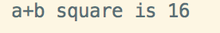
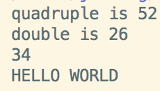

## 9 typedef, 宏定义 ,预编译，文件包含 ,条件编译C标准库，堆内存分配

#### 宏定义
+ 简单的宏定义
  - 无参宏定义
  语法：```#define 标识符 字符串 ```
  ``` # ``` 标识这条命令是一条预处理命令 以之开头的均为预处理命令。
  ```define```表示宏定义命令。
  - 例如：
  ```c
  #define MAXTIME 10000
  if(MAXTIME>100)...
  ```
  编译器在处理这个代码之前会对MAXTIME替换成10000。
  > 这样定义看起来很像const修饰常量，其实还是不同的。define的定义更像是简单的文本替换，而不是把它当做一个变量名来使用。
  > 下面的问题尤为突出。

+ 有参宏定义
  - 语法：```#define 宏名(参数列表) 字符串```
  - 例如：
  ```c
  #define add_1(a,b) a+b;
  #define add_2(1,b) (a+b);
  ```
  上面的两个"函数"定义了加法，但是该函数没有类型检查，有点类似模板，但是没有模板安全。
  >一般使用是没有问题的，但是要注意下面的情况
  > 如：
  ```c
  c*add_1(a,b)*d;
  c*add_2(a,b)*d;
  ```
  > 我们可以看见，我们本意是要计算```c*(a+b)*d```，但是在第一个式子中我们其实得到了```c*a+b*d```的结果，而在第二个式子里，得到了我们想要的结果```c*(a+b)*d```</br>

  上面的例子可以告诉我们，宏定义，只是简单的文本替换，这里面不涉相关的优先级等等，所以在使用的使用我们要小心使用

  - 这里我们在增加一个例子
  ```c
  define pin (int *)
  ```
  ```c
  pin a,b
  int * a, int * b;//我们本意是要申明两个(int *)指针变量a，b
  int * a,b;//其实我们定义了一个(int *) a和一个(int) b
  ```

+ 宏定义的特殊字符
  define中特殊操作符包括```#```、```##```、```...```、```_VA_ARGS ```
  - ```#```字符串化
    假如希望在字符串中包含宏参数，ANSC C允许这么做，使用```#```来做一个宏定义符，之后可以可以把语言符号换字符串。
    例子：
    ```c
    #include <stdio.h>
    #define  ofprint(x) printf(""#x" square is %d\n",(x)*(x));
    int main ()
    {
    int a=1,b=3;
    ofprint(a+b);
    return  1;
    }
    ```
    <!---->
    </br>
    我们使用```#```就是将字符串中的宏参数进行相关的展开，

  - ```##```
    ```##```用于类函数宏的替换部分，也可以用于类对象宏的替换部分。这个运算符把两个语言符号组合成单个语言符号。
    ```c
    #include <stdio.h>
    #define Xname(n) (x##n);
    #define Pxn(n) printf("x"#n"=%d\n",x##n);
    int main ()
    {
    int Xname(1) = 12;//int x1=13
    Pxn(1);//printf("x1=%d\n",x1)
    return  1;
    }
    ```
    官方文档的例子
    ```c
    #include <stdio.h>
    #define FUNCTION(name,a) int fun_##name(int x) { return (x)*a;}
    FUNCTION(quadruple,4)
    FUNCTION(double,2)

    #undef FUNCTION
    #define  FUNCTION 34
    #define OUTPUT(a) puts(#a)

    int main()
    {
    printf("quadruple is %d\n",fun_quadruple(13));
    printf("double is %d\n",fun_double(13));
    printf("%d\n",FUNCTION);
    OUTPUT(HELLO WORLD);
    return 0;
    }
    ```
    

  - 可变参数宏```...```和```_VA_ARGS```
    ```_VA_ARGS```是一个可变参数宏，所谓可变参数宏，类似```fprintf (stderr, format, ##__VA_ARGS__)=```
    例子：
    ```c
    #define PR(...) printf(__VA_ARGS__)
    int main()
    {
    int wt=1,sp=2;
    PR("hello\n");
    //输出：hello
    PR("weight = %d, shipping = %d",wt,sp);
    //输出：weight = 1, shipping = 2
    return 0;
    }
    ```
    - 在介绍几个系统的宏</br>
      1 __VA_ARGS__ 是一个可变参数的宏，很少人知道这个宏，这个可变参数的宏是新的C99规范中新增的，目前似乎只有gcc支持（VC6.0的编译器不支持）。宏前面加上##的作用在于，当可变参数的个数为0时，这里的##起到把前面多余的”,”去掉的作用,否则会编译出错, 你可以试试。</br>
      2 __FILE__ 宏在预编译时会替换成当前的源文件名
      3 __LINE__ 宏在预编译时会替换成当前的行号
      4 __FUNCTION__宏在预编译时会替换成当前的函数名称
+ 宏定义中的多行定义
  ```c
  //宏的多行定义，语法就是在每行的换行加上一个\即可
  #include <stdio.h>
  #define  swap_self(a, b)\
  a=a+b;\
  b=a-b;\
  a=a-b;

  int main() {
    int a = 1;
    int b = 3;
    swap_self(a,b);
    printf("a=%d,b=%d\n",a,b);
    return 0;
  }
  ```
#### typedef
四个用法
+ 命名别名：定义一种变量的别名，不是简单地宏替换。可以用作同时申明指针型的多个对象。比如：```char * a,b;``` 该语句不是完全满足我们语句的，如果我们使用下面语句就是可以的:
    ```c
    typedef char* PCHAR;//一般命名用的是大写。
    PCHAR a,b;//可行，同时申明了两个指向字符变量的指针。
    ```
    使用typedef可以使我们的函数指针更直观方便。
+
    ```c
    typedef struct student{
    int  s_id;
    char s_name[20];
    score s_score[3];
    }stu;
    ```

#### 预编译

#### 条件包含

#### 条件编译

#### C标准库
