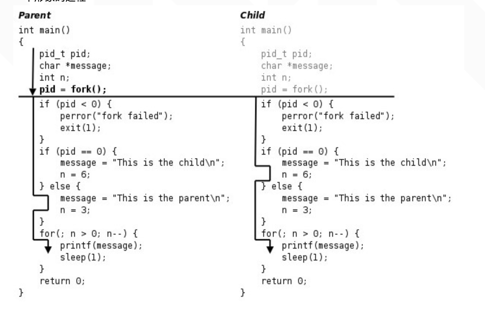

进程
======
目录
-----
 + [进程的基本概念]()
 + [进程的创建](#title_02)
 + 
 + 
 + 
 + 
 + 
 + 
 + 

## 进程的基本概念
  + 进程是系统分配资源的基本单位，计算机资源包括cpu、内存、等其他资源。通过进程，我们才可以真正的实现计算机多道程序的并发执行。
    操作系统是通过调度进程，决定什么进程占用系统资源。
    操作系统不可能直接把每个进程都收纳进去，来调度运行。进程对操作系统表现为PCB，也就是进程控制块。

  + PCB是进程的唯一标识
    - 进程创建的时候，操作系统为进程创建一个进程标识块(PCB)，通过PCB，相当于操作系统为进程分配了系统资源。
    - 进程结束的时候，操作系统回收PCB，并通过PCB，将分配给进程的资源回收上来，实现资源的释放，供其他程序调度时候使用
    - PCB包含的信息：1 进程状态；2 进程的标识信息(PID)；3 定时器；4 用户可见寄存器、栈指针
    - 几个特殊的进程：
      PID=0     调度进程
      PID=1     init进程，计算机的所有其他进程都是由他创建的子进程。
      PID=2     页守护进程，负责支持虚拟存储系统分页操作
  + 进程的状态
    就绪、运行、阻塞

## 进程的创建
    新进程的创建，首先在内存中为新进程创建一个task_struct结构，然后将父进程的task_struct内容复制其中，再修改部分数据。分配新的内核堆栈、新的PID、再将task_struct 这个node添加到链表中。所谓创建，实际上是“复制”。
    子进程刚开始，内核并没有为它分配物理内存，而是以只读的方式共享父进程内存，只有当子进程写时，才复制

    使用fork函数，返回两次，子进程返回0，父进程中返回子进程PID，子进程共享父进程之后的代码
    

    fork之后子进程和父进程执行顺序不一致，取决于内核调度算法，进程之间实现同步需要进程之间通信。

    什么时候需要fork
    一个父进程希望子进程执行不同的代码段，这在网络服务器中常见-父进程等待客户端的服务请求，请求到达的时候，父进程调用fork，使子进程处理此请求。
    一个进程要执行一个不同的程序，一般fork之后立即调用exec

    execve   可执行文件转入内核的linux_binprm结构体。新的进程从main函数开始执行。调用该函数并不是创建新进程，只是替换了当前的代码区，数据区和堆栈，

## 进程的终止
   正常终止
